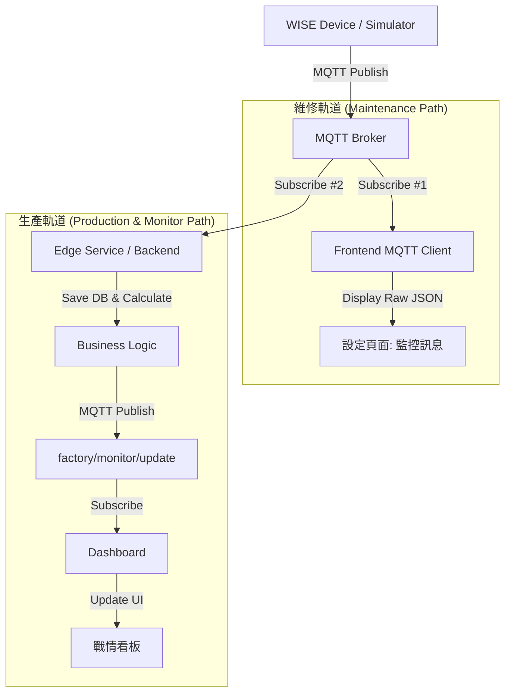

# MQTT 訊息處理流程

本文檔描述 Flexo IoT 系統中，WISE 設備數據與模擬訊號如何透過 MQTT 協定流向前端 Log 與後端即時監控服務的完整流程。

## 系統架構：雙軌制 (Dual-Path Architecture)

本系統採用「維運/生產分離」的雙軌架構，確保維修便利性與生產數據的一致性。



## 1. 即時監控流程 (Real-time Monitoring)

後端作為數據中心，負責接收設備數據、計算衍生指標（如車速）並廣播給前端。

*   **來源**：Backend Service
*   **Topic**：`factory/monitor/update`
*   **方向**：`Backend` -> `MQTT` -> `Frontend (Dashboard)`
*   **Payload**：
    ```json
    {
        "line_speed": 150.5,    // 計算後的即時車速 (m/min)
        "total_length": 5000,   // 當前累計產量
        "status_code": 1,       // 設備狀態 (1: Run, 0: Stop)
        "timestamp": 1705461234 // 數據生成時間
    }
    ```

## 2. 模擬訊號流程 (Simulation Loop)

系統支援兩種模擬模式，用於開發與全鏈路測試。

### 2.1 遠端模式 (Remote Mode) - 預設
模擬真實設備行為，數據先送往後端處理後才回傳前端，驗證完整資料流。

*   **流程**：`Frontend (Sim)` -> `factory/machine/update` -> `Backend` -> `factory/monitor/update` -> `Frontend (Monitor)`
*   **Topic**：`factory/machine/update`
*   **Payload**：(比照 WISE 格式)
    ```json
    {
        "d1": 5000,         // 相當於 DI1 計數
        "s": 1,             // Status Code
        "line_speed": 150,  // 模擬設定速度
        "total_length": 5000 // 同 d1
    }
    ```

### 2.2 本地模式 (Local Mode)
僅在前端內部產生數據並直接更新 UI，不經過 MQTT 與後端。用於單純測試前端畫面邏輯。

## 3. 生產完工回傳 (Production Completion)

前端 Dashboard 在工單完工時，將完整的生產記錄透過 MQTT 回傳至後端資料庫。

*   **觸發時機**：工單完工確認 (Finish Order)
*   **Topic**：`factory/production/completion`
*   **Payload**：
    ```json
    {
        "order_id": "ORD-123",
        "product_id": "P-001",
        "status": "COMPLETED",
        "timestamp": "2026-01-16T10:00:00Z",
        "details": {
            "operator": "John Doe",
            "goodQty": 4950,
            "defectQty": 50,
            "avgSpeed": 150,
            "runTime": 120.0,
            "oee": 85
        }
    }
    ```

## 4. 數據欄位對照表

| 欄位 | 原始 Payload (WISE/Sim) | 內部標準 (Backend) | 前端顯示 (Monitor MQTT) |
| :--- | :--- | :--- | :--- |
| **計數** | `di1` | `total_length` | `currentQty` = `total_length` - `offset` |
| **車速** | (無) | `calculated_speed` | `lineSpeed` |
| **狀態** | `s` | `status_code` | `status` (Run/Stop/Idle) |
| **時間** | `t` | `timestamp` | `lastUpdated` |

## 5. Topic 總覽

| Topic | 訂閱者 (Subscriber) | 發布者 (Publisher) | 用途 |
| :--- | :--- | :--- | :--- |
| `factory/monitor/update` | Frontend (Dashboard) | Backend | 即時監控數據廣播 |
| `factory/machine/update` | Backend | Frontend (Sim / Remote) | 模擬設備訊號上傳 |
| `factory/production/completion` | Backend | Frontend (Dashboard) | 工單完工記錄上傳 |
| `factory/product/file` | Backend | Frontend (Manager) | 產品檔案上傳 |
| `factory/module/+/record` | Backend | Edge Modules | 模組化生產記錄 |

## 附錄：開發與驗證紀錄 (Development & Verification Log)

以下列出本功能開發過程中的執行項目與驗證狀態 (Source: `task.md`)。

### Analysis & Documentation
- [x] Analyze frontend pages (`SettingsPage`, `Dashboard`, etc.) for data fields
- [x] Update `doc/MQTT訊息處理流程.md` with frontend field definitions and MQTT topics

### Simulation Flow Implementation
- [x] Verify/Update Simulation to send data via MQTT (`Advantech/+/data` or `factory/machine/update`)
- [x] Update Backend to publish calculated data (qty, speed) to MQTT for Frontend
- [x] Update Frontend to subscribe to MQTT for real-time monitoring (instead of/in addition to WebSocket)
- [x] Implement UI toggle for "Local" vs "Remote" Simulation in Dashboard
- [x] Refactor Dashboard logic to handle both Local (Direct State) and Remote (MQTT Loop) simulation

### Verification
- [x] Verify Simulation -> Backend -> Frontend flow
- [x] Create walkthrough artifact

### Documentation
- [x] Create SASD Manual (`doc/SASD說明書.md`) based on frontend logic
