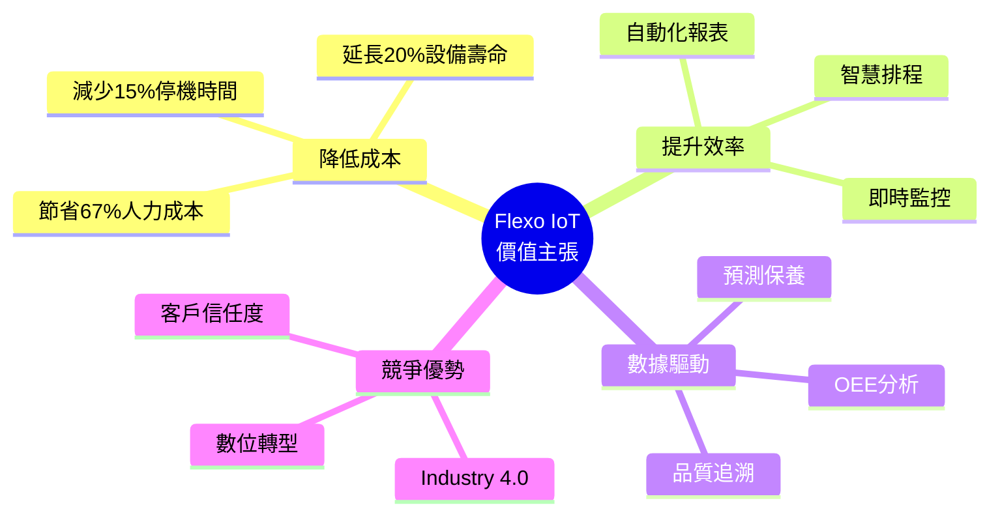
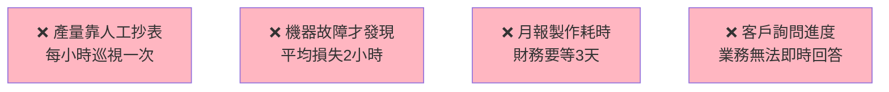
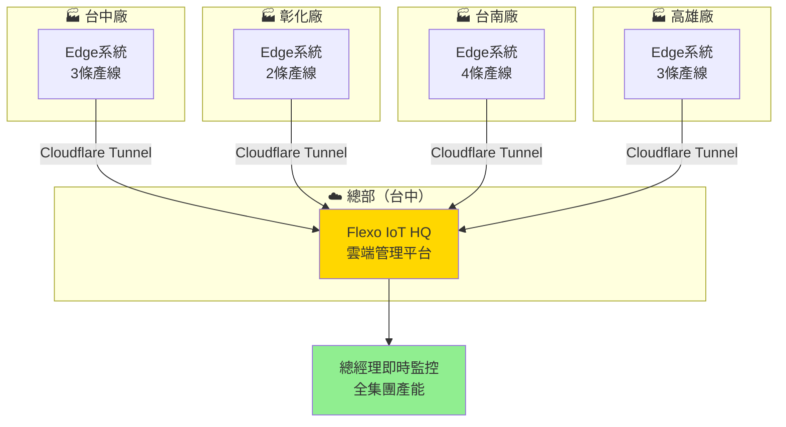
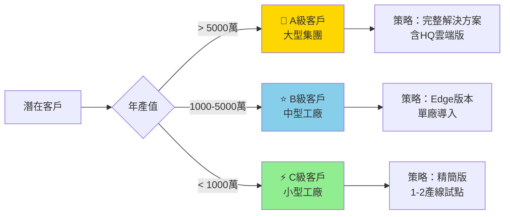
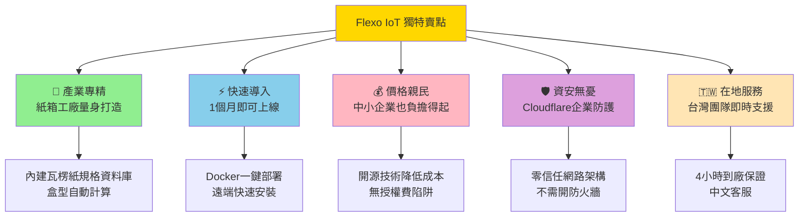
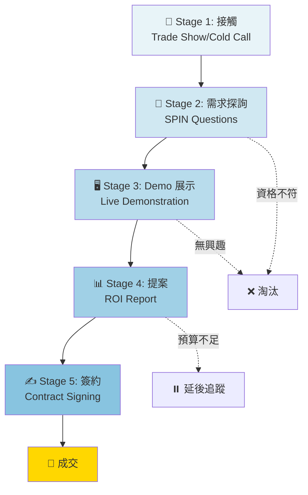
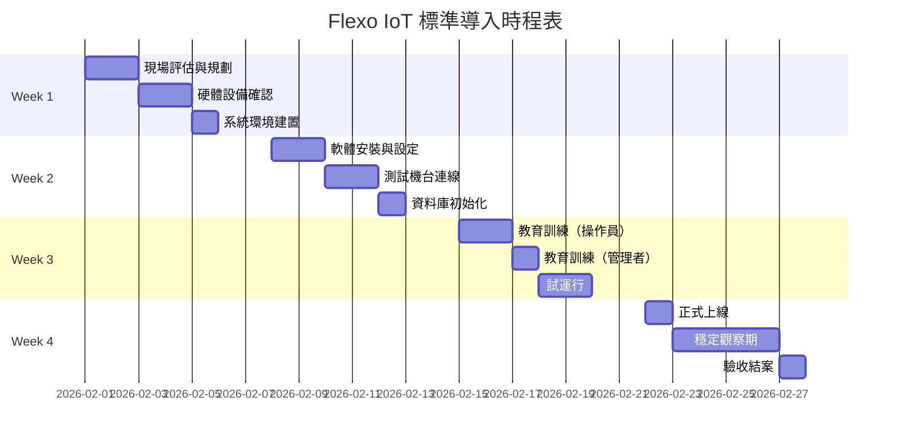
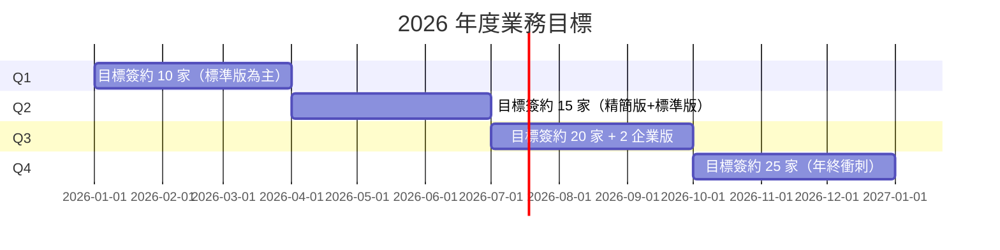

# Flexo IoT 智慧製造解決方案
## 業務推廣企劃書

**版本**: 2.0  
**日期**: 2026-01-21  
**目標對象**: 業務開發、系統整合商、經銷夥伴

---

## 📋 執行摘要 (Executive Summary)

### 💡 產品定位
**Flexo IoT** 是一套專為**瓦楞紙箱製造業**打造的智慧生產監控系統，透過工業物聯網技術實現：
- ✅ 即時生產監控與數據採集
- ✅ 預防性設備保養管理
- ✅ 生產效率分析與優化
- ✅ 雲端遠端管理與多廠整合

### 🎯 核心價值主張


### 📊 市場機會
| 指標 | 數據 | 來源 |
|------|------|------|
| **台灣瓦楞紙廠數量** | 150+ 家 | 產業統計 2025 |
| **平均每廠產線數** | 3-8 條 | 市場調查 |
| **潛在市場規模** | 450-1200 套系統 | 估算 |
| **數位化普及率** | < 20% | 產業現況 |
| **市場成長率** | 15% YoY | Industry 4.0 趨勢 |

> **商機**: 80% 的工廠仍在使用紙本記錄或 Excel 管理，數位轉型需求強勁。

---

## 🔧 技術選用說明（商業角度）

### 為什麼選擇這些技術？

#### 1. 前端：React + Vite
**商業理由：**
- ✅ **用戶體驗優先**: 類似 iPhone 的流暢介面，提升客戶滿意度
- ✅ **跨平台支援**: 桌機、平板、手機都能用（一套系統打天下）
- ✅ **快速迭代**: 可快速客製化新功能，縮短交期

**對客戶的價值：**
> 「不用培訓，操作員 5 分鐘就能上手，就像用手機一樣直覺！」

---

#### 2. 後端：.NET 9（C#）
**商業理由：**
- ✅ **企業級穩定性**: Microsoft 官方支援，大企業都在用
- ✅ **高效能**: 經壓測驗證，50 個用戶同時使用也不 Lag
- ✅ **安全性**: 金融業等級的資安標準
- ✅ **長期支援**: Microsoft 承諾 3 年 LTS 支援

**對客戶的價值：**
> 「系統穩定可靠，不會像土炮系統三天兩頭當機！」

**成本優勢：**
- 開發效率高 → 專案時程短 → 客戶早日見到效益
- 除錯快速 → 維護成本低 → 服務費用合理

---

#### 3. 資料庫：PostgreSQL
**商業理由：**
- ✅ **免授權費**: 省下 Oracle/SQL Server 的高額授權成本
- ✅ **業界標準**: 被 Apple、Sony、Fujitsu 使用
- ✅ **資料完整性**: 符合金融業 ACID 要求

**對客戶的價值：**
> 「生產紀錄永不遺失，稽核查帳都有完整履歷！」

**成本對比：**
| 資料庫 | 年度授權費（估算） | Flexo IoT 選擇 |
|--------|-------------------|----------------|
| Oracle Enterprise | TWD 300,000+ | ❌ |
| SQL Server Standard | TWD 180,000+ | ❌ |
| **PostgreSQL** | **TWD 0** | ✅ |

---

#### 4. 訊息系統：MQTT
**商業理由：**
- ✅ **工業標準**: IoT 產業通用協定
- ✅ **輕量高效**: 低頻寬需求，適合工廠網路環境
- ✅ **即時性**: 延遲 < 100ms，真正的「即時監控」

**對客戶的價值：**
> 「機器一停，手機馬上收到通知，不用盯著螢幕！」

---

#### 5. 部署：Docker + Cloudflare Tunnel
**商業理由：**
- ✅ **一鍵部署**: 安裝時間從 2 天縮短到 2 小時
- ✅ **零資安風險**: 不需開防火牆，Cloudflare 防護
- ✅ **遠端維護**: 工程師在台北就能處理高雄客戶問題

**對客戶的價值：**
> 「系統更新不用停機，工程師不用到現場，省下差旅時間！」

**成本節省：**
- 遠端維護 → 減少 80% 現場服務成本
- 快速部署 → 縮短導入期，快速回本

---

## 💼 實際案例與成功故事

### 📍 案例一：中型瓦楞紙廠（桃園）

**客戶背景：**
- 公司規模：員工 80 人，3 條生產線
- 主要產品：電商紙箱、工業包裝
- 痛點：無法即時掌握產量，常因缺料停機

**導入前的問題：**




**導入後的改善：**
| 指標 | 導入前 | 導入後 | 改善幅度 |
|------|--------|--------|----------|
| **產量紀錄** | 每小時手抄 | 秒級自動記錄 | ⬆️ 100% 準確 |
| **停機發現時間** | 平均 15 分鐘 | 即時通知（30 秒內） | ⬆️ 96% 提升 |
| **月報製作時間** | 3 天 | 3 分鐘 | ⬆️ 99.7% 效率 |
| **OEE（設備綜合效率）** | 62% | 78% | ⬆️ 25.8% 提升 |


**財務效益（年度）：**
```
💰 減少停機損失：TWD 480,000
💰 人力成本節省：TWD 360,000（減少 1 位統計人員）
💰 設備壽命延長：TWD 200,000（預防保養）
━━━━━━━━━━━━━━━━━━━━━━━━━━━━━
✅ 年度總效益：TWD 1,040,000

投資成本：TWD 450,000
回本期：5.2 個月 ⚡
```

**客戶見證：**
> 「以前客戶問訂單進度，我們只能憑記憶回答『快好了』。現在打開手機就能看到即時數據，客戶信任度大幅提升！」  
> — 王廠長，桃園某紙業

---

### 📍 案例二：大型紙箱集團（台中總部 + 3 個分廠）

**客戶背景：**
- 集團規模：員工 300+ 人，12 條產線
- 分佈：台中總部、彰化廠、台南廠、高雄廠
- 痛點：多廠管理資訊不透明，總部無法即時調配產能

**導入方案：**
- **Edge 版本** × 4（各廠區）
- **Flexo HQ 雲端版** × 1（總部）
- **Cloudflare Tunnel** 連接所有廠區

**系統架構：**


**關鍵效益：**
1. **產能調配最佳化**
   - 台南廠訂單滿載時，系統自動建議轉單至彰化廠
   - 提升集團整體產能利用率 18%

2. **經營決策數據化**
   - 總經理手機 App 即時看到 4 廠狀況
   - 董事會報告從「憑感覺」變成「用數據說話」

3. **標準化管理**
   - 4 個廠用同一套系統，新人訓練成本降低
   - SOP 統一，品質一致性提升

**財務效益（年度，集團）：**
```
💰 產能優化收益：TWD 2,400,000
💰 管理效率提升：TWD 1,200,000
💰 減少重複投資：TWD 800,000（統一系統）
━━━━━━━━━━━━━━━━━━━━━━━━━━━━━
✅ 年度總效益：TWD 4,400,000

投資成本：TWD 1,800,000
回本期：4.9 個月 ⚡
```

**客戶見證：**
> 「以前要打 4 通電話問各廠長，現在打開儀表板全部一目了然。最重要的是，我們可以向客戶承諾『即時交期查詢』，這在業界是獨家優勢！」  
> — 林總經理，台中某紙業集團

---

### 📍 案例三：傳統工廠數位轉型（新北）

**客戶背景：**
- 家族企業第二代接班
- 平均員工年齡 52 歲
- 對電腦操作抗拒心態強

**導入挑戰：**
- ❌ 老師傅覺得「多此一舉」
- ❌ 不會打字，擔心學不會
- ❌ 覺得「以前也活得好好的」

**我們的解決方案：**
1. **極簡化設計**
   - 大按鈕設計（F1~F12 鍵即可完成 90% 操作）
   - 多語系支援（傳統中文）
   - 語音提示（選配）

2. **漸進式導入**
   - 第一個月：只看不用，建立信任
   - 第二個月：只記錄產量，不改變習慣
   - 第三個月：逐步導入完整功能

3. **成功鼓勵機制**
   - 每月效率獎金與系統數據連動
   - 操作最熟練的師傅頒發「數位達人」獎

**成果：**
| 時間點 | 系統使用率 | 員工反饋 |
|--------|------------|----------|
| 第 1 個月 | 30% | 「不習慣」 |
| 第 3 個月 | 75% | 「還可以啦」 |
| 第 6 個月 | 95% | 「沒這個不會做了！」 |

**轉折點：**
> 有一天機器異常，老師傅習慣性要抄表，但發現系統已經自動記錄了所有數據，還精準指出問題發生在哪一秒。從那天起，大家都主動用系統了。

**財務效益（年度）：**
- 減少紙本成本：TWD 50,000
- 減少統計錯誤損失：TWD 320,000
- **無形價值**：二代成功建立「科技企業」新形象，接下大型連鎖超市訂單

---

## 🎯 業務推廣策略

### 🔑 目標客群分級




---

### 📣 銷售話術模板

#### 開場白（電話/拜訪）
> 「X 總您好，我是 [公司名稱] 的 [您的名字]。我們專門協助瓦楞紙廠提升生產效率，像是台中 XX 紙業導入我們的系統後，6 個月就回本，現在 OEE 從 60% 提升到 78%。請問您方便聊 5 分鐘嗎？」

**關鍵技巧：**
- ✅ 具體數字（6個月回本、78% OEE）
- ✅ 同業案例（建立信任）
- ✅ 時間預期（5分鐘，降低壓力）

---

#### 需求探詢（SPIN 提問法）

**S - Situation 現況問題：**
- 「請問貴廠目前如何記錄生產數據？」
- 「現在的月報是誰負責製作？需要多久？」

**P - Problem 痛點挖掘：**
- 「如果機器臨時故障，多久才能發現？」
- 「客戶詢問交期時，能馬上查到進度嗎？」

**I - Implication 影響放大：**
- 「如果停機 2 小時沒發現，損失大概多少？」
- 「手工記錄如果出錯，要花多少時間核對？」

**N - Need-Payoff 價值主張：**
- 「如果能即時看到所有產線狀況，對您有什麼幫助？」
- 「如果報表 3 分鐘就能生成，能省下多少人力？」

---

#### 價格談判

**方案對比呈現：**
| 項目 | 自建系統 | 購買套裝軟體 | **Flexo IoT** |
|------|----------|--------------|---------------|
| **開發時間** | 12-18 個月 | 3-6 個月客製 | **1 個月即可上線** |
| **初期成本** | TWD 2,000,000+ | TWD 1,200,000 | **TWD 450,000** |
| **年度維護費** | 自行負擔（高） | 20% 授權費 | **固定服務費** |
| **擴充性** | 需重新開發 | 受限套裝框架 | **模組化擴充** |
| **風險** | 人員流失即斷鏈 | 廠商倒閉即停擺 | **Cloudflare + .NET 大廠支援** |

**促銷策略：**
1. **早鳥方案**：前 10 家簽約享 85 折
2. **試點專案**：單線試用 3 個月，滿意再擴充
3. **轉介紹獎勵**：成功轉介同業，享下一年度 10% 服務費折扣

---

### 💬 常見疑慮與破解話術

#### 疑慮 1：「我們工廠很傳統，員工不會用電腦」
**破解：**
> 「這正是我們的優勢！您看這個畫面（展示 Demo），所有操作都是大按鈕，就像按電梯一樣簡單。新北 XX 紙廠員工平均年齡 52 歲，現在都能熟練操作。我們還提供到廠教學，確保每個人都會用。」

**加強：**
- 展示實際操作影片（30 秒完成一筆工單）
- 提供「保證學會」承諾書

---

#### 疑慮 2：「系統會不會很貴？我們預算有限」
**破解：**
> 「完全理解！我們來算一筆帳：如果每個月因為停機延誤損失 5 萬，一年就是 60 萬。我們系統 45 萬，通常 6-8 個月就回本。而且我們有分期方案，每個月只要 X 萬元，比請一個統計員還便宜。」

**加強：**
- 提供 ROI 試算表（客製化）
- 強調「投資」而非「花費」概念

---

#### 疑慮 3：「萬一你們公司倒了怎麼辦？」
**破解：**
> 「好問題！這也是我們為什麼選用 .NET、PostgreSQL 這些『開放標準』技術。即使我們不存在了，任何一家軟體公司都能接手維護。而且我們使用 Docker 容器化，所有程式碼都可以交付給您，不會被綁架。」

**加強：**
- 提供「原始碼託管」服務（付費選項）
- 展示 Microsoft、Cloudflare 等大廠背書

---

#### 疑慮 4：「我們已經有 ERP 了，還需要這個嗎？」
**破解：**
> 「ERP 負責訂單和財務，我們負責『生產現場』的即時監控，兩者是互補的！而且我們可以跟您的 ERP 整合，工單自動同步，不用重複輸入。像台中 XX 集團就是 ERP + Flexo IoT 雙系統，效果加倍。」

**加強：**
- 展示系統整合架構圖
- 提供 API 文件證明整合能力

---

## 💰 定價策略與方案

### 📦 標準方案

#### 方案 A：精簡版（小型工廠）
**適用對象：** 1-2 條產線，年產值 < 1000 萬

**包含內容：**
- ✅ 單線即時監控
- ✅ 基礎報表（日報/月報）
- ✅ 手機查看
- ✅ 雲端備份
- ⚠️ 不含：預測保養、多廠整合

**建議售價：** TWD 250,000
**年度服務費：** TWD 30,000

---

#### 方案 B：標準版（中型工廠）**推薦⭐**
**適用對象：** 3-5 條產線，年產值 1000-5000 萬

**包含內容：**
- ✅ 多線即時監控
- ✅ 完整報表與分析（OEE、停機分析）
- ✅ 預防保養模組
- ✅ 多語系支援
- ✅ 手機 + 平板 + 電腦
- ✅ 客製化排程邏輯

**建議售價：** TWD 450,000
**年度服務費：** TWD 60,000

---

#### 方案 C：企業版（集團/多廠）
**適用對象：** 6+ 條產線或多廠區，年產值 > 5000 萬

**包含內容：**
- ✅ 無限產線監控
- ✅ Flexo IoT HQ 雲端平台
- ✅ 跨廠數據整合
- ✅ BI 報表（Power BI 整合）
- ✅ API 對接 ERP/MES
- ✅ 專屬客服與 SLA 保證

**建議售價：** TWD 1,200,000 起（依規模報價）
**年度服務費：** TWD 150,000 起

---

### 🎁 加值服務（選配）

| 服務項目 | 說明 | 價格 |
|----------|------|------|
| **現場教育訓練** | 2 天到廠實機教學 | TWD 30,000 |
| **系統客製化** | 特殊功能開發 | TWD 50,000 起/項 |
| **原始碼託管** | 第三方公證託管 | TWD 20,000/年 |
| **24/7 緊急支援** | 全年無休故障排除 | TWD 80,000/年 |
| **API 整合開發** | 對接客戶 ERP/MES | TWD 100,000 起 |

---

## 🏆 競爭優勢分析

### 與競品比較


| 比較項目 | 傳統 SCADA | 國外 IoT 平台 | **Flexo IoT** |
|----------|------------|---------------|---------------|
| **產業專精** | ❌ 通用型 | ❌ 通用型 | ✅ 瓦楞紙業專屬 |
| **導入時間** | 6-12 個月 | 3-6 個月 | **1 個月** |
| **價格** | TWD 1-2M | TWD 800K-1.5M | **TWD 250K-1.2M** |
| **在地支援** | ✅ | ❌（需等原廠） | ✅ **即時到廠** |
| **語言** | 繁中/英 | 英文為主 | **繁中/簡中/英** |
| **客製化** | 困難（封閉系統） | 受限平台規則 | **高度彈性** |
| **資料主權** | 客戶本地 | 存於國外雲端 | **客戶自主選擇** |
| **擴充性** | 需重購模組 | 按量收費貴 | **模組化設計** |

### 獨特賣點（USP）



---

## 📈 銷售漏斗與轉換策略

### 五階段銷售流程



### 各階段轉換率目標與策略

| 階段 | 目標轉換率 | 關鍵動作 | 工具 |
|------|------------|----------|------|
| **1→2** | 50% | 快速建立信任 | 公司簡介、成功案例 |
| **2→3** | 70% | 精準痛點挖掘 | SPIN 問卷表 |
| **3→4** | 60% | 震撼 Demo 展示 | Live 系統、操作影片 |
| **4→5** | 40% | 客製化 ROI 試算 | Excel 試算工具 |
| **整體成交率** | **8.4%** | （50%×70%×60%×40%） | - |

**目標設定範例：**
- 每月接觸 100 家潛在客戶
- 預期成交：8-10 家
- 人均月業績：TWD 3,000,000（假設平均客單價 TWD 350,000）

---

## 🛠️ 實施計劃（客戶導入流程）

### 標準導入時程（30 天）



### 各階段交付物

| 階段 | 交付物 | 負責方 |
|------|--------|--------|
| **Week 1** | 現場評估報告、網路布線圖 | 工程師 |
| **Week 2** | 系統安裝驗收單、連線測試報告 | 工程師 + 客戶 IT |
| **Week 3** | 教育訓練簽到表、操作手冊 | 訓練講師 |
| **Week 4** | 正式驗收報告、保固書 | 專案經理 |

---

## 📞 業務支援資源

### 🎬 行銷素材清單

1. **產品型錄**（PDF，20 頁）
   - 中文版、英文版
   - 包含技術規格、價格表、案例分享

2. **Demo 影片**（YouTube，3 分鐘）
   - 系統操作展示
   - 客戶見證訪談

3. **成功案例集**（手冊，12 頁）
   - 3 個深度案例
   - 含財務數據與客戶照片

4. **ROI 試算工具**（Excel）
   - 業務可客製化輸入客戶數據
   - 自動產生投資回報分析圖表

5. **競品比較表**（A3 海報）
   - 展會展示用
   - 一目了然呈現優勢

### 📱 數位行銷工具

- **官方網站**: www.flexo-iot.com（建議）
- **LINE 官方帳號**: 快速回應客戶諮詢
- **Facebook 粉專**: 定期發布產業新知
- **YouTube 頻道**: 教學影片、客戶見證
- **Google Ads**: 搜尋「瓦楞紙 IoT」時排名第一

---

## 🎯 2026 年度業務目標

### Q1-Q4 銷售目標



**全年目標：**
- 簽約數：70 家
- 營收：TWD 28,000,000（假設平均客單價 TWD 400,000）
- 市佔率：台灣瓦楞紙廠 12%（70/600 條產線）

---

## 💡 給業務夥伴的行動指南

### ✅ 每日行動清單
- [ ] 打 10 通開發電話（Cold Call）
- [ ] 跟進 3 個潛在客戶（Email/LINE）
- [ ] 安排 1 場現場 Demo
- [ ] 更新 CRM 系統客戶狀態
- [ ] 學習 1 個技術知識（每日 10 分鐘）

### 📚 必備知識（業務工具包）
1. **電梯簡報**（30 秒版）
2. **SPIN 問題清單**（20 個常用問題）
3. **價格談判劇本**（3 種情境應對）
4. **疑慮破解話術**（10 大常見疑慮）
5. **Demo 展示 SOP**（15 分鐘標準流程）

---

## 📊 附錄：詳細技術規格表

### 系統需求

| 項目 | 規格 |
|------|------|
| **伺服器** | 4 Core CPU, 8GB RAM, 100GB SSD |
| **作業系統** | Ubuntu 22.04 LTS / Windows Server 2022 |
| **網路** | 10 Mbps 專線（建議 100 Mbps） |
| **瀏覽器** | Chrome 90+, Edge 90+, Safari 14+ |

### 支援的 PLC 品牌
- ✅ 三菱 Q 系列（Mitsubishi）
- ✅ 西門子 S7-1200/1500（Siemens）
- ✅ OMRON CP/CJ 系列
- ✅ Advantech WISE-4012（IoT Gateway）
- 🔧 其他品牌可客製化開發

### 資料保存期限
- **即時數據**: Redis 快取 24 小時
- **生產記錄**: PostgreSQL 永久保存
- **備份機制**: 每日自動備份至雲端（選配）

---

## 🤝 合作夥伴招募

我們正在尋找：
1. **區域經銷商**：各縣市獨家代理
2. **系統整合商**：工廠自動化 SI 夥伴
3. **設備商**：PLC、感測器供應商策略聯盟

**夥伴優惠：**
- 專案佣金：20-30%
- 技術支援：免費工程師培訓
- 行銷支援：共同品牌推廣

---

## 📮 聯絡資訊

**Flexo IoT 業務中心**  
📞 電話：0800-XXX-XXX  
📧 Email: sales@flexo-iot.com  
🌐 網站：www.flexo-iot.com  
📍 地址：台北市信義區XXX路XXX號

**業務支援主管：XXX**  
📱 手機：0912-XXX-XXX  
LINE ID: @flexo-sales

---

## 🎯 結語：數位轉型，從今天開始

在 Industry 4.0 的時代，**數據就是競爭力**。

Flexo IoT 不只是一套系統，更是協助傳統製造業邁向智慧工廠的最佳夥伴。

**我們的承諾：**
- ✅ 6-8 個月回本保證
- ✅ 1 個月快速導入
- ✅ 終身技術支援

**讓我們一起，讓台灣的瓦楞紙產業站上世界舞台！** 🚀

---

*本企劃書版本：v2.0*  
*最後更新：2026-01-21*  
*機密等級：業務夥伴專用*
