# Flexo IoT 智慧工廠系統 - 高中生簡報
*讓工廠像玩遊戲一樣即時掌控生產線*

---

## 📚 第一章：什麼是工業物聯網 (IoT)?

### 🤔 你知道嗎？
想像一下，如果你的手機可以：
- 📱 即時顯示你家冷氣的溫度
- 🔔 在電池快沒電時自動提醒你
- 📊 記錄你每天走了多少步

這就是「物聯網」的概念！**把設備連上網路,讓它們會說話、會報告狀態**。

### 🏭 工業物聯網就是...
把這個概念應用到工廠機器上！


傳統工廠：
- ❌ 機器壞了才知道
- ❌ 生產多少要人工數
- ❌ 問題發生後才能查

智慧工廠（有 IoT）：
- ✅ 機器即時回報狀態
- ✅ 電腦自動計算產量
- ✅ 所有數據都有記錄

---

## 🎯 第二章：Flexo IoT 系統簡介

### 我們做了什麼？
這是一個為**瓦楞紙箱工廠**設計的智慧監控系統，就像給工廠裝上「智慧腦」！


### 🎮 就像遊戲介面一樣
- 生產線速度 → 就像賽車遊戲的時速表
- 機器狀態燈 → 就像遊戲角色的血條（綠色=正常，紅色=停機）
- 生產數量 → 就像遊戲得分

---

## 🛠️ 第三章：系統架構 - 它是怎麼運作的？

### 🧩 系統的四大元件

#### 1️⃣ 感測裝置（眼睛和耳朵）
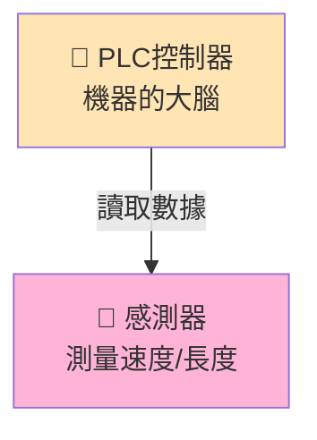

**白話說明：**
- PLC 就像機器的「小電腦」
- 感測器會偵測：紙箱跑多快？做了幾個？
- 這些數據每秒都在更新！

#### 2️⃣ 資料傳輸（信差）
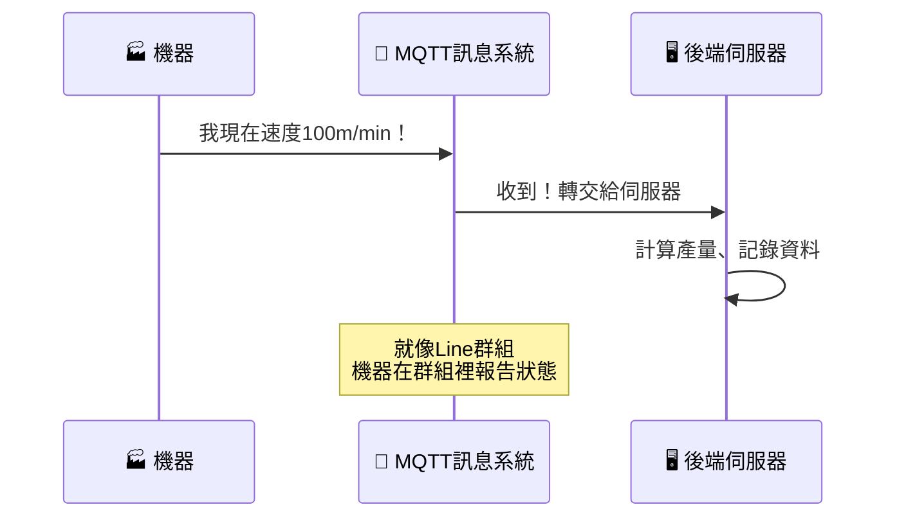

**白話說明：**
- MQTT 就像「工廠專用的 Line 群組」
- 機器在群組裡不停發訊息：「我現在跑100米/分鐘！」
- 電腦收到訊息後會自動整理

#### 3️⃣ 後端處理（大腦）
這是系統的「智慧核心」，做三件事：

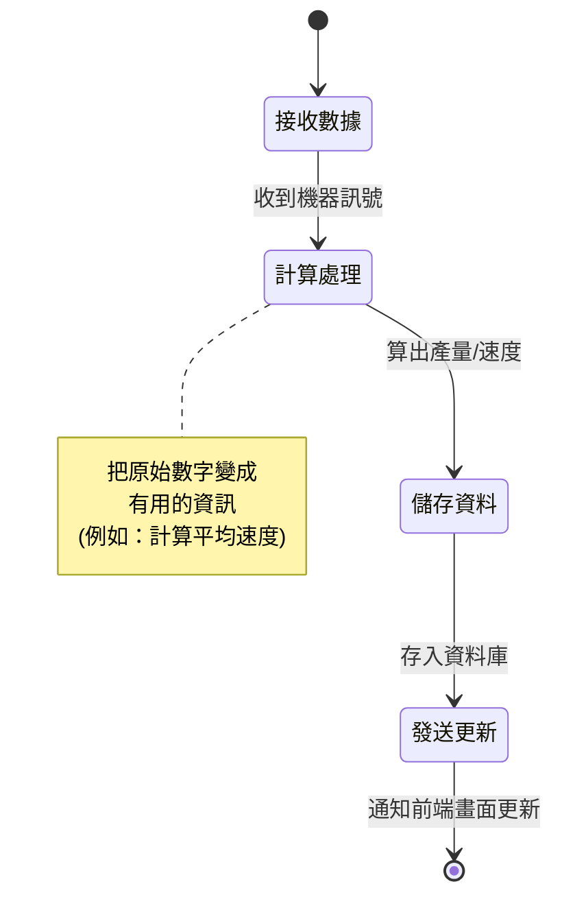

**功能詳解：**
1. **接收數據**：收到機器發來的原始數字
2. **計算處理**：算出速度、產量、效率
3. **儲存記錄**：把資料存進資料庫（就像存檔）

#### 4️⃣ 前端介面（眼睛能看到的部分）
這是操作員和老闆看到的畫面！


---

## 📱 第四章：使用者介面 - 實際操作畫面

### 🎨 主畫面功能

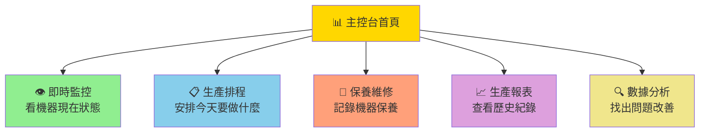

### 功能說明（用高中生能懂的比喻）

| 功能 | 就像... | 實際用途 |
|------|---------|----------|
| **即時監控** | 玩賽車遊戲看儀表板 | 看機器現在跑多快、做了多少 |
| **生產排程** | 排課表 | 安排今天要生產哪些訂單 |
| **保養維修** | 汽車保養紀錄本 | 記錄機器何時該保養 |
| **生產報表** | 成績單 | 看這個月生產了多少 |
| **數據分析** | 健檢報告 | 找出哪裡效率不好 |

---

## ⚙️ 第五章：實際應用案例

### 案例 1：即時監控生產狀態

**問題情境：**
以前工廠領班要知道生產狀況，必須：
1. 走到機器旁邊看
2. 問操作員做了多少
3. 手寫記錄在紙上

**現在有了 IoT：**
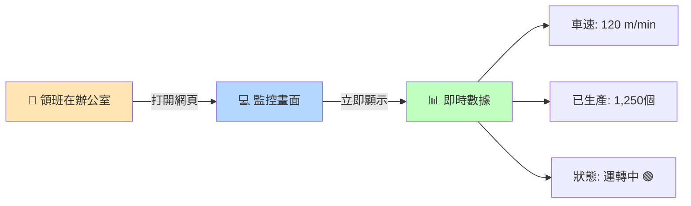

**效果：**
- ⏱️ 省時間：不用走來走去
- ✅ 更準確：電腦自動計算，不會算錯
- 📱 隨時查：用手機也能看

---

### 案例 2：聰明的保養提醒

**傳統做法：**
- 😰 機器突然壞掉才修
- 💸 損失很多生產時間

**IoT 智慧保養：**
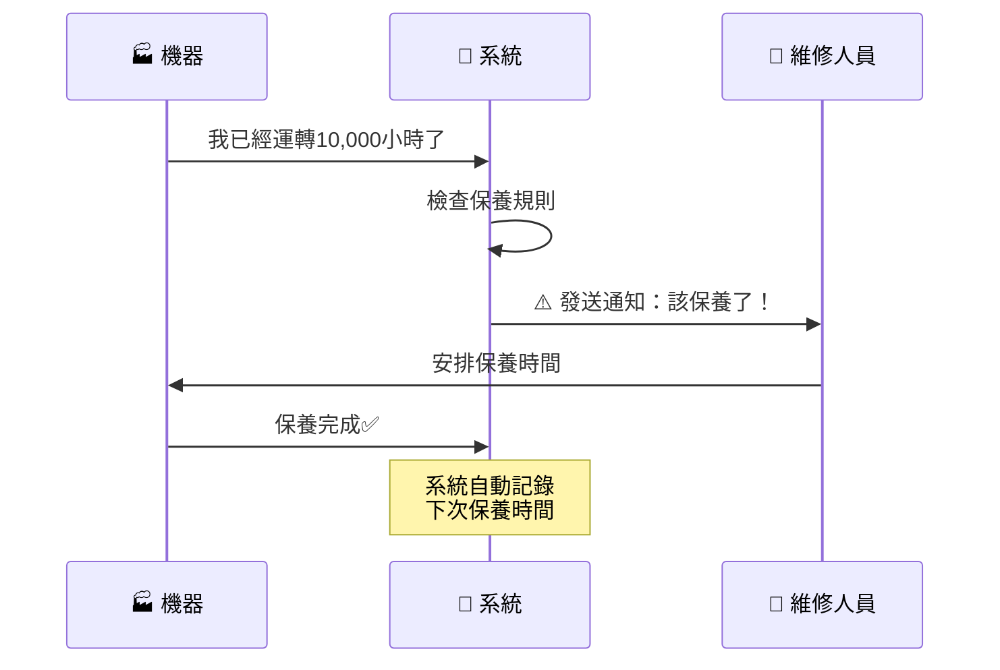

**好處：**
- 🛡️ **預防性保養**：在壞掉前就保養
- 📅 **自動提醒**：不會忘記保養時間
- 📝 **完整紀錄**：知道何時保養過什麼

---

### 案例 3：數據分析找問題

**真實情境：**
工廠發現這個月產量下降，但不知道原因...

**用 IoT 分析：**
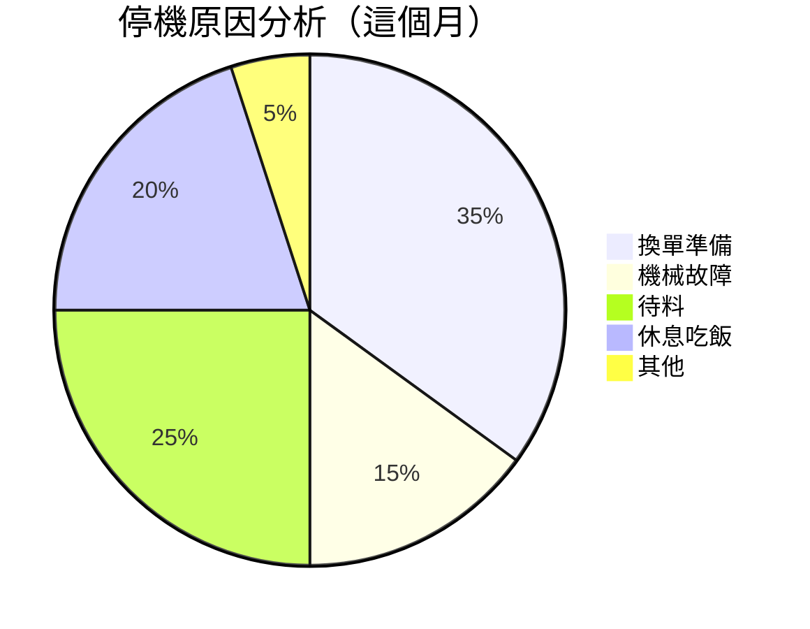

**發現：**
- 😮 原來「換單準備」佔了35%的停機時間
- 💡 改善方向：訓練員工加快換單速度
- 📈 結果：下個月換單時間減少10分鐘

---

## 🔐 第六章：資安與雲端部署

### 為什麼要注意資安？
工廠的生產數據很重要，不能被駭客偷走或破壞！

### 我們的防護措施

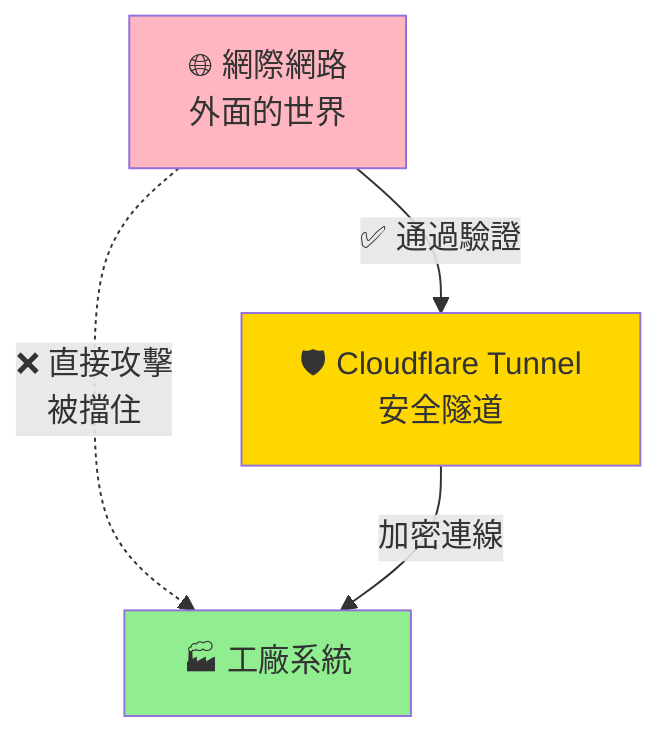

**白話說明：**
- **Cloudflare Tunnel**：就像工廠大門的保全
- **加密連線**：資料傳輸時會「變成密碼」
- **身份驗證**：只有獲得授權的人才能登入

---

## 🐳 第七章：容器化部署（Docker）

### 什麼是 Docker？
> 就像樂高積木，每個服務是一塊積木，組合起來就是完整系統！

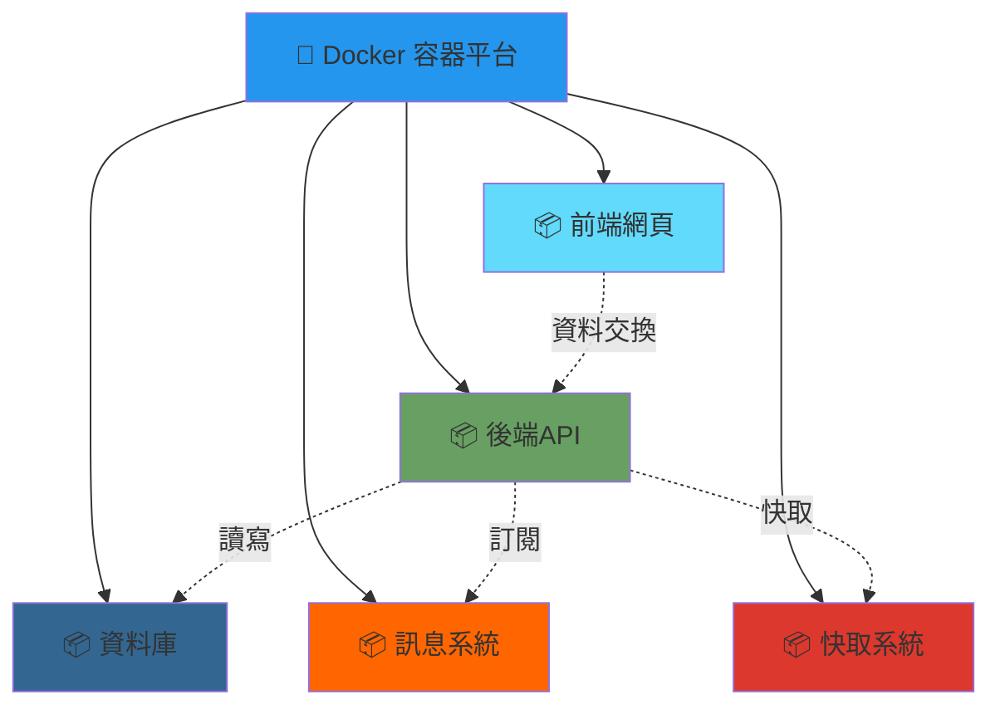

### 為什麼用 Docker？

| 傳統安裝 | Docker 容器化 |
|----------|---------------|
| ❌ 每台電腦要重新設定 | ✅ 一個指令全部啟動 |
| ❌ 更新很麻煩 | ✅ 直接換新版積木 |
| ❌ 不同電腦可能出錯 | ✅ 確保每台都一樣 |

---

## 📊 第八章：技術架構總覽

### 完整系統架構圖

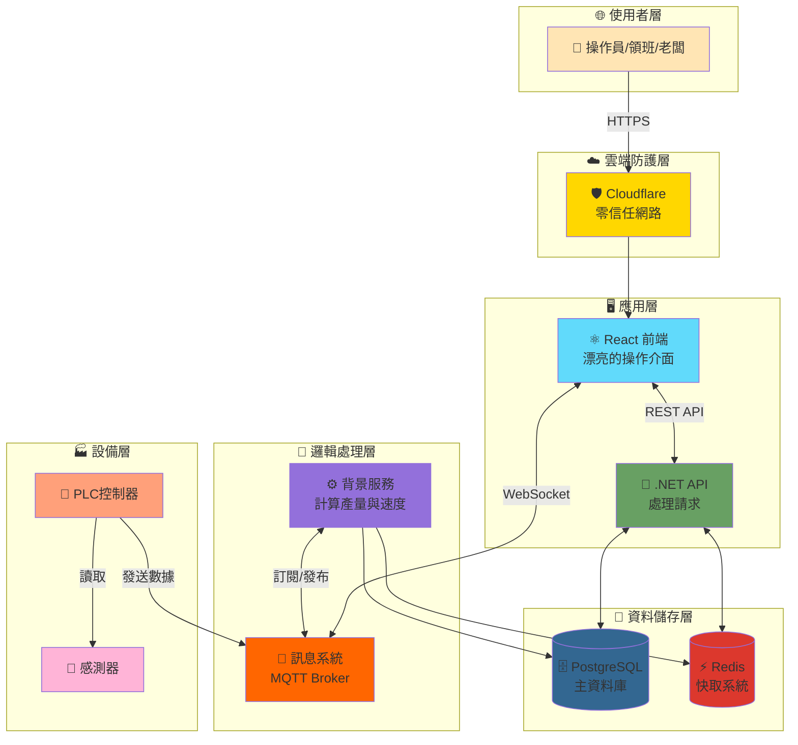

### 各層說明


1. **🌐 使用者層**：工廠人員用瀏覽器或手機操作
2. **☁️ 雲端防護層**：確保連線安全
3. **🖥️ 應用層**：美觀的操作介面
4. **🧠 邏輯處理層**：處理所有計算和邏輯
5. **💾 資料儲存層**：儲存所有數據
6. **🏭 設備層**：工廠實體機器

---

## 🎓 第九章：用到的技術（給想學程式的同學）

### 前端技術
```
⚛️ React 18
  └─ 📦 Vite (建置工具)
  └─ 🎨 Material UI (介面元件)
  └─ 📡 MQTT.js (即時通訊)
```

**學習建議：**
- 想做漂亮介面 → 學 React + CSS
- 想做即時更新 → 學 WebSocket/MQTT
- 推薦資源：freeCodeCamp、React 官方教學

---

### 後端技術
```
🔧 .NET 9 (C#)
  ├─ 🌐 ASP.NET Core Web API
  ├─ ⚙️ Worker Service (背景服務)
  ├─ 🗄️ Entity Framework Core (資料庫)
  └─ 📮 MQTTnet (訊息處理)
```

**學習建議：**
- 想寫伺服器 → 學 C# + ASP.NET
- 想處理資料 → 學 SQL
- 推薦資源：Microsoft Learn、C# 黃皮書

---

### 資料庫與訊息系統
```
💾 資料儲存
  ├─ PostgreSQL (關聯式資料庫)
  └─ Redis (快取 + 計數器)

📮 訊息傳遞
  └─ Mosquitto MQTT Broker
```

---

## 🚀 第十章：這個系統帶來的改變

### 數據對比

#### ⏱️ 效率提升
| 項目 | 傳統方式 | IoT 系統 | 改善程度 |
|------|----------|----------|----------|
| 數據記錄 | 30分鐘/次 | 即時自動 | ⬆️ 100% |
| 問題發現 | 延遲1-2天 | 立即通知 | ⬆️ 95% |
| 報表產生 | 2小時 | 3分鐘 | ⬆️ 97.5% |

#### 💰 成本節省
- 減少停機損失：**每月省下 15% 的停機時間**
- 預防性保養：**設備壽命延長 20%**
- 人力精簡：**數據人員從3人減為1人**

---

## 🌟 第十一章：未來發展方向

### 🔮 可能的擴充功能

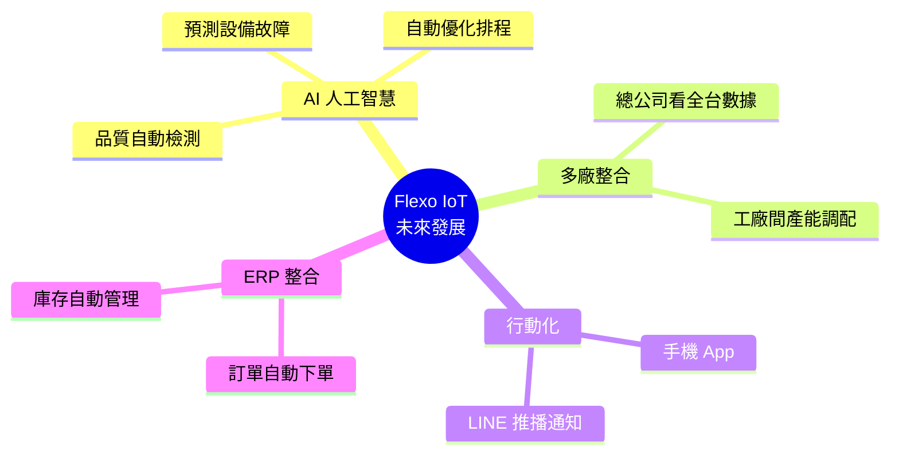

### 💡 創新應用

1. **機器學習預測**
   - 分析歷史數據，預測何時會故障
   - 提前備料，減少等待時間

2. **AR 擴增實境維修**
   - 戴上AR眼鏡，看到維修步驟提示
   - 新手也能快速學會

3. **能源監控**
   - 追蹤用電量
   - 找出最省電的生產時段

---

## 📚 第十二章：相關職業與學習路徑

### 🎯 這個專案涉及的職業


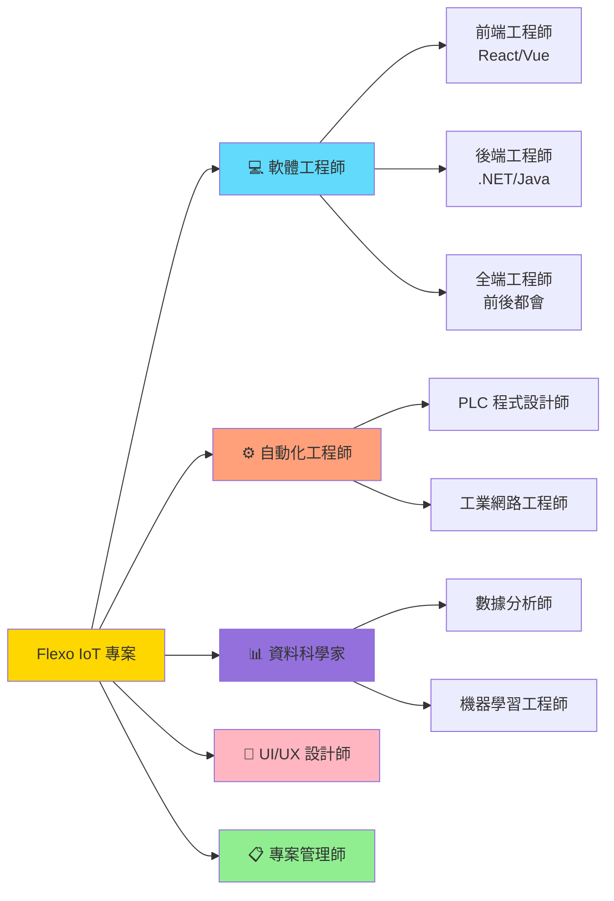

### 📖 高中生可以開始的學習路徑

#### 💻 想當軟體工程師？
1. **高一：** 學 Python 基礎（最簡單的程式語言）
2. **高二：** 學網頁基礎（HTML, CSS, JavaScript）
3. **高三：** 做小專題（例如：個人網站、計算機）

**推薦資源：**
- 🌐 Codecademy
- 📺 YouTube：彭彭的課程
- 📚 書籍：《Python 小學生也會寫程式》

#### ⚙️ 想當自動化工程師？
1. **高中：** 物理、數學要打好基礎
2. **選系：** 機械工程、電機工程
3. **技能：** Arduino、樂高機器人

**推薦資源：**
- 🤖 Arduino 官方教學
- 🏫 高工職校的自動化科

#### 📊 想當資料科學家？
1. **高中：** 數學、統計要學好
2. **程式：** Python + Excel 進階應用
3. **實作：** 分析學校運動會數據

---

## 🎬 總結：IoT 改變了什麼？

### 從「被動反應」到「主動預防」

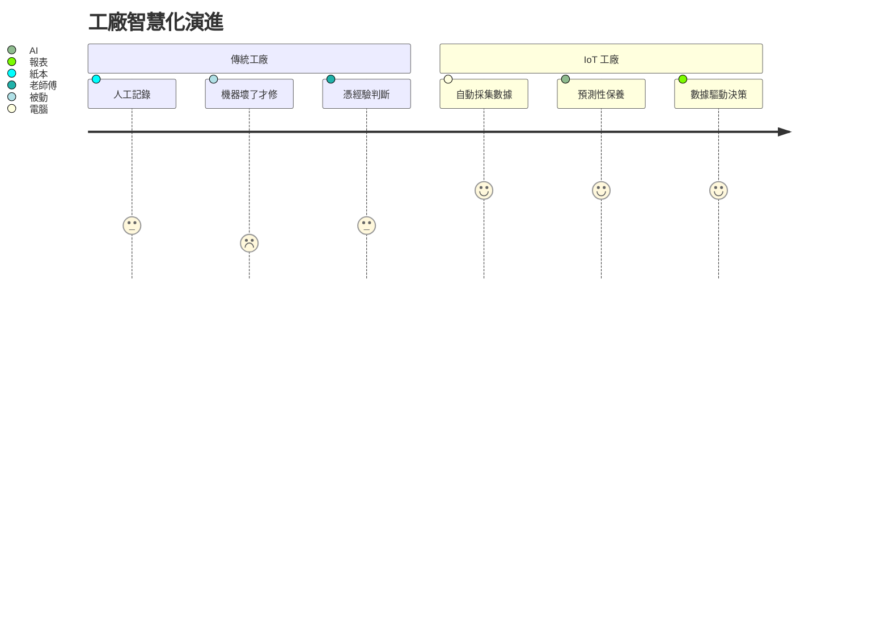

### 🌈 這個專案教會我們的事

1. **跨領域整合很重要**
   - 需要軟體、硬體、工業知識
   - 團隊合作才能完成

2. **小改變，大影響**
   - 一個監控系統，省下大量成本
   - 科技讓工作更有效率

3. **終身學習**
   - 技術不斷更新
   - 保持好奇心，持續學習

---

## 🙋 Q&A 常見問題

### Q1: 這個系統很貴嗎？
**A:** 相較於傳統工廠改造，我們用開源技術（免費軟體）降低成本。主要花費在硬體（感測器、工控電腦），通常半年到一年就能回本。

### Q2: 需要懂很多程式嗎？
**A:** 要做這個系統需要程式基礎，但操作系統不需要！就像你會用手機，但不需要懂怎麼造手機。

### Q3: 小工廠也能用嗎？
**A:** 當然可以！系統可以縮小規模，甚至一台機器也能監控。

### Q4: 學這個以後能做什麼工作？
**A:** 很多！軟體工程師、自動化工程師、資料分析師、系統整合商...都是熱門職缺。

### Q5: 高中生現在可以做什麼？
**A:** 
- 🔧 參加學校的機器人社團
- 💻 線上學 Python 或 JavaScript
- 📱 試著做個小 App 或網頁
- 🏆 參加程式競賽（如：APCS）

---

## 🎓 結語：歡迎來到智慧製造的時代！

工業4.0 不是遙不可及的未來，而是正在發生的現在。

這個 Flexo IoT 專案只是一個開始，未來的工廠會更聰明、更環保、更有效率。

**而你們，正是創造這個未來的關鍵！** 🚀

---

### 📮 聯絡資訊與更多資源

**專案相關：**
- 📂 專案文件：`/doc` 資料夾
- 🔧 技術手冊：`Supervisor_Manual.md`
- 📖 系統架構：`SASD說明書.md`

**學習資源：**
- 🌐 [Microsoft Learn](https://learn.microsoft.com/)
- 🐍 [Python 官方教學](https://docs.python.org/zh-tw/3/tutorial/)
- ⚛️ [React 官方文件](https://react.dev/)
- 🤖 [Arduino 入門](https://www.arduino.cc/en/Tutorial/HomePage)

**工業IoT 社群：**
- 💬 台灣工業4.0社群
- 🏭 智慧製造論壇
- 📱 相關技術討論區

---

**感謝聆聽！有任何問題歡迎發問 🙋**
