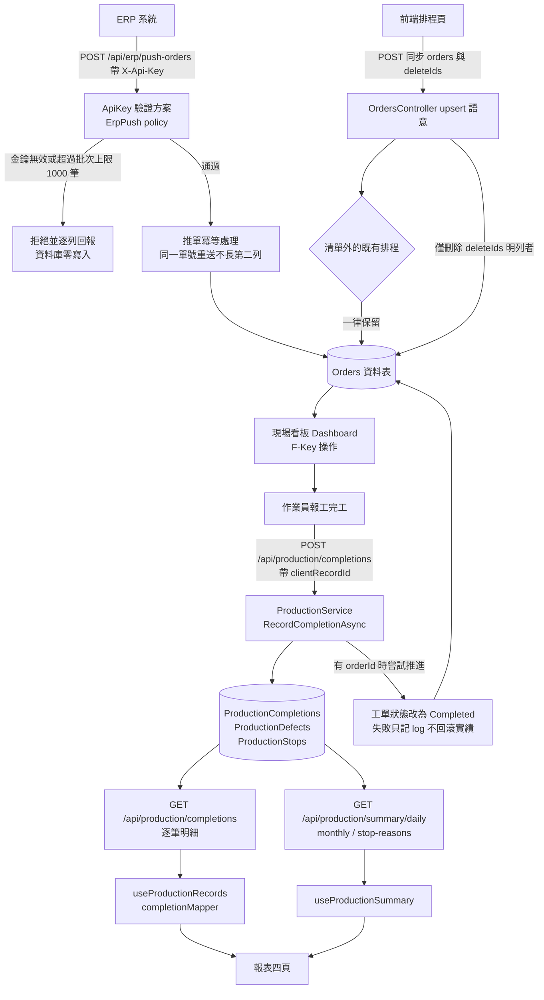
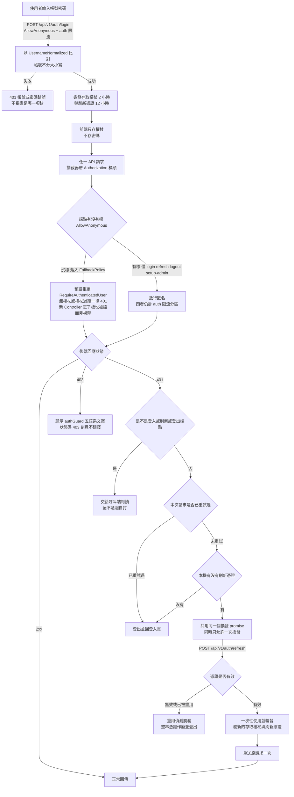
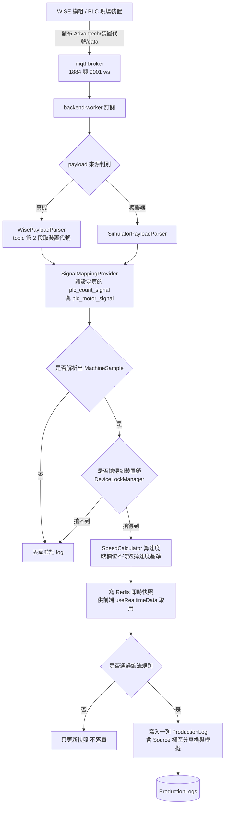
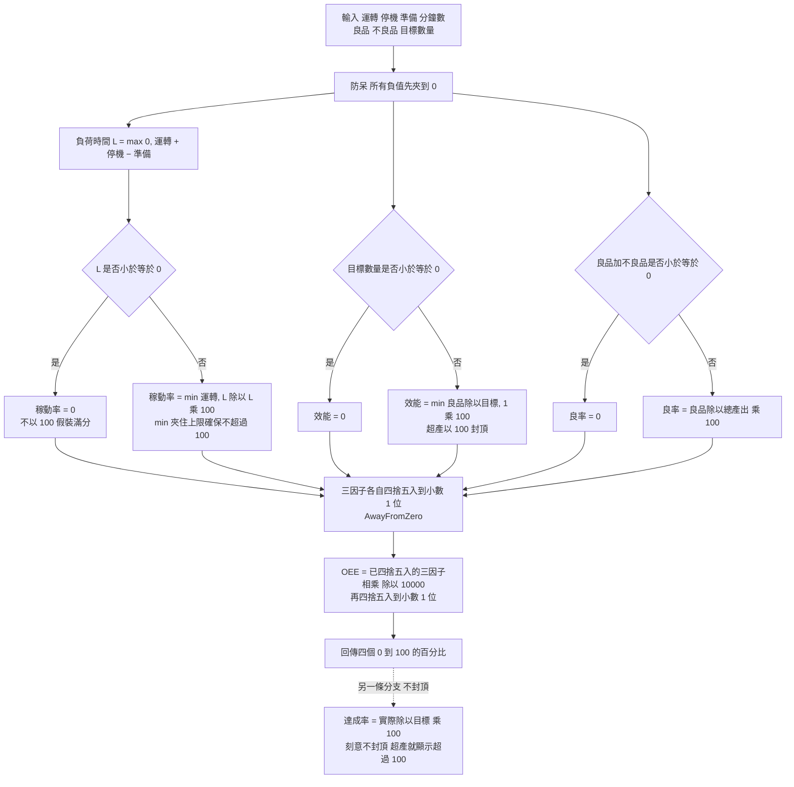
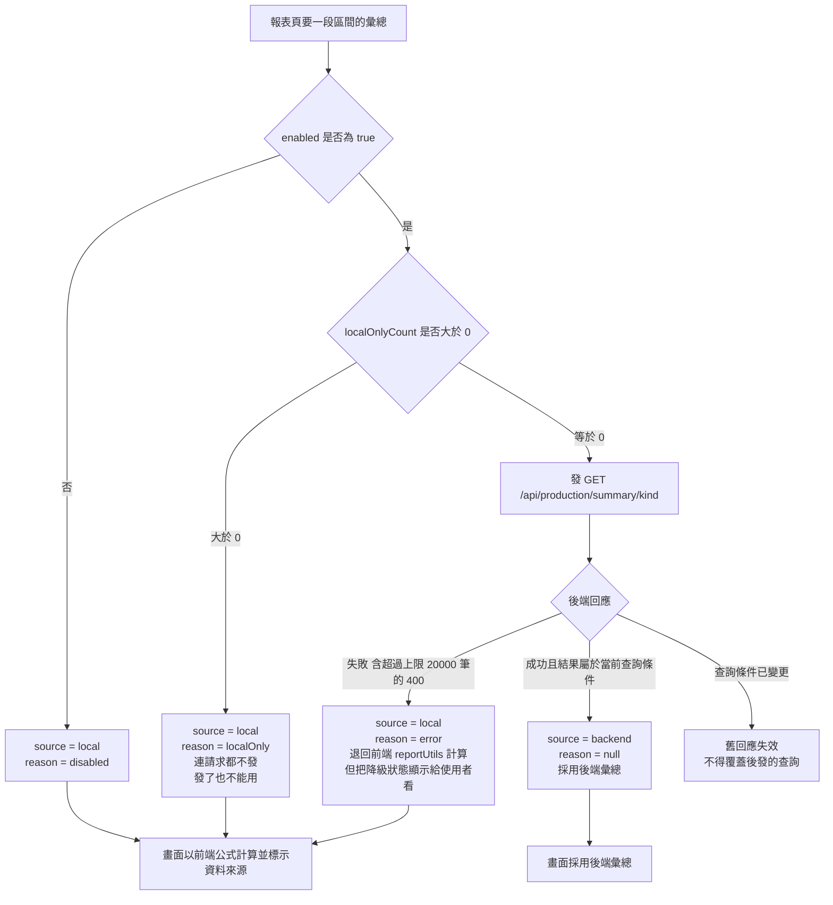
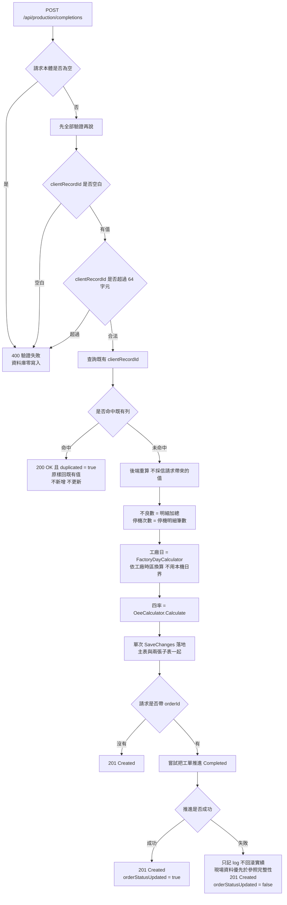

# S9 · Printing IoT 設計規劃書對抗性重整

> 日期:2026-09-07
> 版本:v1
> 稽核對象:`doc/整合設計與重新拆分規劃_20260617.md`(2026-06-17)
> 性質:**設計文件重整,不含程式碼異動**
> 交付路徑:`docs/`(**不得**寫入 `doc/` —— 該目錄由 `DocsController` 對外提供,會直接出現在產品 UI)

---

## 0. 本文件的立場

被稽核的規劃書寫於 2026-06-17,距今三個月。它的目的是請 Eric 在「重新拆分方案 A/B/C」之間拍板;
在那之後系統經歷了 Smart Parts 外移、S1–S8 八趟實作與一次正式上線,而該文件**從未更新**。

因此本文件採**對抗性稽核**立場:

> **舊文件裡的每一條宣稱都視為待證偽的假設。**
> 不採信任何文件自述(含 `doc/` 底下所有舊文件),一律回到程式碼與**執行中的系統**取證。
> 每一條結論都必須附上「用什麼指令、讀哪個檔:行號」才算數。

驗證環境注意事項(不照做會整輪盲跑):

- 本機 Claude Code 的 Bash 沙箱會讓 `dotnet` 與 `docker` **假失敗**。這兩個指令一律要
  `dangerouslyDisableSandbox: true`。
- 查執行中的資料庫一律用:
  `docker compose exec -T postgres psql -U postgres -d FlexoDB -tAc "<SQL>"`(同樣需停用沙箱)。

#### 實查時點與環境基準

本文件所有標記「實查」的結果,都是在**2026-09-07** 於下列環境對**執行中的容器與資料庫**取得的:

| 項目 | 實查值 | 取得方式 |
|---|---|---|
| 實查日期 | **2026-09-07** | `date` |
| 專案根 | `/Volumes/G70Pro/cusor pool/Printing IoT` | — |
| HEAD | `69ca7b8`(2026-09-06 上線執行紀錄) | `git log --oneline -1` |
| 檢出分支 | `main`(內容與 `fix/audit-20260903` 同一個 commit) | `git branch --show-current` |
| 執行中的容器 | `printingiot-{frontend,backend-api,backend-worker,postgres,redis,mqtt-broker,cloudflared}-1` 共 7 個 | `docker compose ps` |
| 資料庫 | 單一 `FlexoDB`,13 張業務表 + `__EFMigrationsHistory` | `psql` 見 §1.3 |

> **列數宣稱怎麼讀**:凡是「某表 = 0 列」屬**結構性事實**(該資料流至今沒跑過真資料),
> 可作判定依據;凡是**非零列數**一律是 2026-09-07 的**快照**,天天在動,複驗時數字不同
> 不代表本文件失真。詳見 §1.7 開頭。

---

## 1. 漂移對照表(逐條證偽)

判定分三級:**仍成立** / **已漂移**(方向對但內容過期) / **已不存在**(宣稱的東西根本不在了)。

### 1.1 §1 系統全景

| # | 舊文件原宣稱 | 實地驗證結果 | 判定 | 查證方式 |
|---|---|---|---|---|
| D-01 | A2「Smart Parts 零件管理(內建模組),已併入主 backend-api,資料在 FlexoDB」 | 主系統全域搜不到任何 Smart Parts 程式碼;`Parts`/`Suppliers`/`SupplierParts`/`Inventory` 四表在 FlexoDB 均不存在 | **已不存在** | `grep -rn "smartparts\|SmartParts\|sm-frontend" --include="*.cs" --include="*.js" --include="*.jsx" backend/PrintingIoT.API backend/PrintingIoT.Core frontend/src docker-compose.yml`(0 命中);`docker compose exec -T postgres psql -U postgres -d FlexoDB -tAc "SELECT tablename FROM pg_tables WHERE schemaname='public' ORDER BY 1;"` |
| D-02 | 前端 `sm-frontend :5100`,對外 `smartparts.ericchh.work` | `docker-compose.yml` 無此服務,repo 無此目錄,`docker compose ps` 無此容器 | **已不存在** | `grep -nE "^  [a-z-]+:" docker-compose.yml`;`docker compose ps` |
| D-03 | 「主系統 `Part` / `Supplier` / `SupplierPart` 留主系統」(§4 易混淆對照) | 主系統已無 `/api/v1/parts` 端點與相關實體;該對照表的「留主系統」欄已失效 | **已不存在** | `grep -rn "api/v1/parts\|suppliers" --include="*.cs" backend/PrintingIoT.API`(0 命中) |
| D-04 | Smart Parts 移出的時點 | migration `20260706143822_RemoveSmartPartsModule`,2026-07-06 | **新事實**(舊文件寫成前不存在) | `ls backend/PrintingIoT.Infrastructure/Migrations/` |
| D-05 | 主前端 `frontend :5600`、後端 `backend-api :5200`、FlexoDB `:5433`、Redis `:6380`、MQTT `:1884 / 9001` | 全部相符 | **仍成立** | `docker compose ps --format "table {{.Name}}\t{{.Service}}\t{{.Status}}\t{{.Ports}}"` |
| D-06 | MM 為真分離、自帶 MmsDB、後端 `:5300`、前端 `:5301` | 相符,且 `mm-postgres-1` 已改綁 `127.0.0.1:5434`(安全修復,不要改回 `0.0.0.0`) | **仍成立(有強化)** | `docker ps --format "{{.Names}}\t{{.Status}}\t{{.Ports}}" \| grep -i mm` |

### 1.2 §2 部署現況

| # | 舊文件原宣稱 | 實地驗證結果 | 判定 | 查證方式 |
|---|---|---|---|---|
| D-07 | compose 內含 9 個主系統相關服務(含 sm-frontend) | 只有 **7 個**:`frontend` / `backend-api` / `backend-worker` / `postgres` / `redis` / `mqtt-broker` / `cloudflared` | **已漂移** | `grep -nE "^  [a-z-]+:" docker-compose.yml` |
| D-08 | 「`smartparts.ericchh.work → http://frontend:5600` 重複規則建議刪除」 | 該待辦已隨 Smart Parts 外移而失去標的;Tunnel 設定不在本 repo,無法由 repo 佐證,需在 Cloudflare Dashboard 確認殘留路由 | **已漂移**(改列開放問題 O-05) | repo 內 `find . -name "*.yml" -path "*cloudflare*"` 無命中;需登入 Cloudflare Zero Trust Dashboard 查 |
| D-09 | 「`mms.ericchh.work` 建議新增,MM 前端目前只能本機 :5301」 | MM 前端仍只暴露 `0.0.0.0:5301`;是否已加 Tunnel 路由無法由本 repo 佐證 | **未證實**(改列開放問題 O-05) | `docker ps ... \| grep mm-mms-frontend` |

### 1.3 §3.1 主系統資料模型

下表每一列的「查證方式」都是**可獨立重跑的完整指令**(刻意重複貼出,不寫「見上」):

| # | 舊文件原宣稱的資料表 | 實查 FlexoDB | 判定 | 查證方式 |
|---|---|---|---|---|
| D-10 | `Machines` | 不在表清單中 | **已不存在** | `docker compose exec -T postgres psql -U postgres -d FlexoDB -tAc "SELECT tablename FROM pg_tables WHERE schemaname='public' AND tablename='Machines';"` → 空輸出 |
| D-11 | `Alarms` | 不在表清單中 | **已不存在** | 同型指令,`tablename='Alarms'` → 空輸出 |
| D-12 | `Parts` | 不在表清單中 | **已不存在** | 同型指令,`tablename='Parts'` → 空輸出;另 `grep -rn "api/v1/parts" --include="*.cs" backend` → 0 命中 |
| D-13 | `Suppliers` | 不在表清單中 | **已不存在** | 同型指令,`tablename='Suppliers'` → 空輸出 |
| D-14 | `SupplierParts` | 不在表清單中 | **已不存在** | 同型指令,`tablename='SupplierParts'` → 空輸出 |
| D-15 | `Inventory` | 不在表清單中 | **已不存在** | 同型指令,`tablename='Inventory'` → 空輸出 |
| D-16 | `Users` / `Roles` / `UserRoles` | 三張皆在表清單中 | **仍成立** | `docker compose exec -T postgres psql -U postgres -d FlexoDB -tAc "SELECT tablename FROM pg_tables WHERE schemaname='public' AND tablename IN ('Users','Roles','UserRoles') ORDER BY 1;"` → 三列 |
| D-17 | 「`Orders`/排程、生產履歷、產品檔」 | `Orders` / `Products` 存在;「生產履歷」實際落地的表名為 `ProductionLogs`,舊文件用的是口語名而非實體表名 | **部分成立**(名稱須更正) | `docker compose exec -T postgres psql -U postgres -d FlexoDB -tAc "SELECT tablename FROM pg_tables WHERE schemaname='public' AND tablename IN ('Orders','Products','ProductionLogs') ORDER BY 1;"` → 三列;實體定義見 `backend/PrintingIoT.Core/Entities/ProductionLog.cs` |

> 上表八條的**共同來源指令**(一次取得完整表清單,可用來複驗上表每一列):
> ```bash
> docker compose exec -T postgres psql -U postgres -d FlexoDB -tAc \
>   "SELECT tablename FROM pg_tables WHERE schemaname='public' ORDER BY 1;"
> ```
> **2026-09-07 實查結果(13 張業務表 + 1 張 EF 歷史表)**:
> `ApiKeys, MachineSections, Orders, ProductionCompletions, ProductionDefects, ProductionLogs,
> ProductionStops, Products, ReasonCodes, RefreshTokens, Roles, UserRoles, Users`(+`__EFMigrationsHistory`)。
>
> **逐一結算**(舊文件 §3.1 明確點名的實體表共 **10 張**:`Users`、`Roles`、`UserRoles`、
> `Machines`、`Alarms`、`Orders`、`Parts`、`Suppliers`、`SupplierParts`、`Inventory`,
> 另有「排程 / 生產履歷 / 產品檔」三個口語名):
>
> | 結算 | 張數 | 表名 |
> |---|---|---|
> | **已不存在** | **6** | `Machines`、`Alarms`、`Parts`、`Suppliers`、`SupplierParts`、`Inventory` |
> | **仍成立** | **4** | `Users`、`Roles`、`UserRoles`、`Orders` |
> | 口語名須更正為實體表名 | 3 | 「生產履歷」→ `ProductionLogs`;「產品檔」→ `Products`;「排程」即 `Orders` 本身 |
> | 舊文件**完全沒有**、現已存在 | **7** | `ApiKeys`、`MachineSections`、`ProductionCompletions`、`ProductionDefects`、`ProductionStops`、`ReasonCodes`、`RefreshTokens` |
>
> **判定**:舊文件點名的 10 張表中 **6 張已不存在**(全數屬 Smart Parts 與已移除的監控實體),
> 認證三表與 `Orders` 仍成立;同時現況多出 **7 張它一個字都沒提的表**。
> 換言之,它的資料模型**對了不到一半,且漏掉了一半的現況** —— 已不足以作為設計依據,
> 但**不是**「全部都錯」。此處刻意不誇大:對抗性稽核的可信度來自逐張結算,不是來自結論夠聳動。

### 1.4 §3.1 認證宣稱(本次稽核最要緊的一條)

| # | 舊文件原宣稱 | 實地驗證結果 | 判定 | 查證方式 |
|---|---|---|---|---|
| D-18 | 「認證:JWT ＋ BCrypt ＋ Role-based ＋ Rate Limiting」 | 2026-06-17 當時是「**門鎖裝好但沒上鎖**」—— 元件都在,但後端沒有預設拒絕,無權杖一樣打得進去。2026-09-03 三輪對抗性稽核的頭號根因即此。S5/S6(commit `9e86cf9`)才真正接通 | **當時為假,現已為真** | `grep -n "FallbackPolicy" backend/PrintingIoT.API/Program.cs` → `Program.cs:84` 設定 `FallbackPolicy` 為需驗證;`git log --oneline 9e86cf9` |
| D-19 | 角色為「Role-based」 | 已升級為**具名 policy**:`UserAdmin` / `SystemConfig` / `MasterDataWrite` / `ErpPush`,角色常數集中在 `AppRoles` | **已漂移(強化)** | `backend/PrintingIoT.API/Program.cs:88-96`;`backend/PrintingIoT.Core/Constants/AppRoles.cs` |
| D-20 | Rate Limiting | 存在,且已啟用 `ForwardedHeaders` 並移到 CORS 之後;登入/刷新/登出走具名分區 `auth` | **仍成立(有強化)** | `Program.cs:32-35, 102-125, 165-184`;`AuthController.cs:52-54, 93-95, 148-150` |

> **教訓寫在這裡而不是註腳**:一份設計文件寫「有 JWT」不等於系統有在驗。
> 本文件之後所有安全宣稱,判準一律是「**預設拒絕是否成立**」,不是「元件是否存在」。

### 1.5 技術棧與治理缺口

| # | 舊文件原宣稱 | 實地驗證結果 | 判定 | 查證方式 |
|---|---|---|---|---|
| D-21 | 技術棧 .NET 8 | 五個 csproj **全部** `net9.0` | **已漂移** | `grep -rn "TargetFramework" backend/*/*.csproj` |
| D-22 | §6-2「MM 尚未 `git init`,建議納入版控」 | 已是獨立 repo `https://github.com/eric4577599/MM.git`,堆疊執行中 | **已解決** | `cd /Volumes/G70Pro/cusor pool/MM && git remote -v`;`docker ps \| grep mm-` |
| D-23 | §6-1「HANDOVER / 開發說明書 / PROJECT_STATUS 敘述過期,本文件可作新 SSOT」 | 該文件自己也過期了三個月,已不能當 SSOT | **已漂移**(本文件取代其索引地位) | 本表 D-01~D-21 |
| D-24 | §5「方案 B 是目前狀態」 | Smart Parts 已於 2026-07 外掛化,現況是「**方案 C 走了一半**」:零件已抽出、保養已抽出,核心只剩監控/排程/報表 | **已被現實跨過** | D-01~D-04、D-10~D-15 |
| D-25 | §7 決策題「Smart Parts 去留」「MM 版控」 | 兩題都已被事件解決,不再是決策題 | **已被現實跨過** | D-04、D-22 |

### 1.6 舊文件完全沒有的東西(S1–S8)

以下八件事全部發生在 2026-06-17 之後,舊文件**一個字都沒提**。它們改變了主系統的資料流本體,
不納入就無法描述現況。

| # | 事件 | 落地證據 | 查證方式 |
|---|---|---|---|
| N-01 | **S1 訂單資料正確性** —— 排程同步改 upsert 語意(清單外的既有排程一律保留)、推單冪等 + 批次上限 + 逐列回報 | `backend/PrintingIoT.API/Controllers/OrdersController.cs:77-78`;`ErpController.cs:24`(`DefaultMaxPushBatchSize = 1000`) | `grep -n "upsert\|deleteIds" backend/PrintingIoT.API/Controllers/OrdersController.cs` |
| N-02 | **S2 Worker 真機訊號落地** —— 真機路徑補寫 `ProductionLogs` 並與模擬器合流;設定頁的 `plc_motor_signal` / `plc_count_signal` 真正生效 | `backend/PrintingIoT.Worker/Services/TelemetryPipeline.cs:118-137`;`SignalMappingProvider.cs:104-105` | `grep -rn "plc_motor_signal\|plc_count_signal" --include="*.cs" backend` |
| N-03 | **S3 完工實績後端化** —— `ProductionCompletions` / `ProductionDefects` / `ProductionStops` / `ReasonCodes` 四表 | migration `20260904010000_AddProductionCompletion`、`20260904020000_AddReasonCodes`;實查四表皆在 | 見 §1.3 表列指令 |
| N-04 | **OEE 權威計算集中到後端** | `backend/PrintingIoT.Core/Services/OeeCalculator.cs`(132 行,純靜態無相依) | `wc -l backend/PrintingIoT.Core/Services/OeeCalculator.cs` |
| N-05 | **工廠日** `FactoryDayCalculator` —— 完工日界改工廠時區 | `backend/PrintingIoT.Core/Services/FactoryDayCalculator.cs:10` | `grep -rn "class FactoryDayCalculator" backend` |
| N-06 | **S4 報表四頁改讀後端** —— 對映層 + 共用 hook | `frontend/src/utils/completionMapper.js`;`frontend/src/hooks/useProductionRecords.js` | `ls frontend/src/hooks frontend/src/utils` |
| N-07 | **S5+S6 認證授權端到端接通**;帳號不分大小寫,以 `UsernameNormalized` 唯一索引背書 | migration `20260905010000_AddUsernameNormalizedUniqueIndex`;`Program.cs:84` 預設拒絕;實查 `Users` 每列 `Username`/`UsernameNormalized` 皆一致(**2026-09-07 快照為 6 列**,列數會隨帳號增刪變動,判定依據是「每列正規化一致」而非列數) | `docker compose exec -T postgres psql -U postgres -d FlexoDB -tAc 'SELECT "Username","UsernameNormalized","IsActive" FROM "Users" ORDER BY 1;'` |
| N-08 | **S7 ERP 機器對機器憑證** —— `ApiKeys` 表、`X-Api-Key` 標頭、獨立 `ApiKey` 驗證方案、`ErpPush` policy,**只對推單端點有效** | `Program.cs:77-78, 95-96`;`ErpController.cs:14`;`AppRoles.cs` `ErpService` / `Policies.ErpPush` | `grep -n "ApiKey\|ErpPush" backend/PrintingIoT.API/Program.cs` |
| N-09 | **S7 權杖刷新** —— `RefreshTokens` 表,一次性 + 輪替 + 重用偵測;前端 401 → 換發 → **重送原請求**,同時只允許一次換發 | migration `20260905220130_AddRefreshTokens`;`frontend/src/services/api.js:38-120` | `grep -n "refreshPromise\|REFRESH_PATH\|401" frontend/src/services/api.js` |
| N-10 | **S8 後端彙總端點** `/api/production/summary/{daily,monthly,stop-reasons}` | `backend/PrintingIoT.API/Controllers/ProductionController.cs:86, 101, 117` | `grep -n "HttpGet" backend/PrintingIoT.API/Controllers/ProductionController.cs` |
| N-11 | **OEE 黃金向量**(C# 與 JS 讀同一個檔,任一邊改公式而沒改另一邊就立刻紅) | `tests/fixtures/oee-golden-vectors.json`(4855 bytes) | `ls -la tests/fixtures/`;`head tests/fixtures/oee-golden-vectors.json` |
| N-12 | **2026-09-06 已上線** —— 13 個 migration 全部套用(含本輪 8 個)、`admin` 與 `OP1`~`OP5` 已建立 | `__EFMigrationsHistory` **13 列**(此數字**不是快照**:migration 是 append-only,只增不減,與 `ls Migrations/ \| grep -v Designer \| grep -v Snapshot` 的 13 個檔逐一對應);`Users` 帳號皆 `IsActive = t`(**2026-09-07 快照為 6 列**) | `docker compose exec -T postgres psql -U postgres -d FlexoDB -tAc 'SELECT "MigrationId" FROM "__EFMigrationsHistory" ORDER BY 1;'`;`ls backend/PrintingIoT.Infrastructure/Migrations/ \| grep -v Designer \| grep -v Snapshot \| wc -l` |

### 1.7 本次稽核自己抓到、先前未列的漂移

這六條不在交辦清單裡,是本輪查證時撞出來的。

> **列數宣稱的兩種效力(讀本節前先看這段)**
>
> - **`= 0` 類宣稱**(`ProductionLogs` / `ProductionCompletions` / `Products` / `ApiKeys`):
>   是**結構性事實**——「這條資料流至今沒跑過真資料」。可直接作為判定依據。
> - **非零列數**(`Orders` / `RefreshTokens` / `ReasonCodes` / `MachineSections` / `Users`):
>   是**2026-09-07 15:00 前後的快照**,這些值天天在動。
>   複驗時**數字不同不代表本文件錯**,只有「趨勢或性質變了」(例如 `Products` 由 0 變非 0)才需要更新對應條目。

| # | 觀察 | 實查數據(2026-09-07) | 數據性質 | 意義 | 查證方式 |
|---|---|---|---|---|---|
| D-26 | **`ProductionLogs` 目前 0 列** | `ProductionLogs = 0` | **結構性事實**(可作判定依據) | S2 的訊號落地**程式碼在、線上尚無任何真機資料**。「Worker → ProductionLogs」這條主線目前只有測試背書,沒有生產資料背書 → 開放問題 O-01 | `docker compose exec -T postgres psql -U postgres -d FlexoDB -tAc 'SELECT count(*) FROM "ProductionLogs";'` |
| D-27 | **`ProductionCompletions` 目前 0 列** | `ProductionCompletions = 0` | **結構性事實**(可作判定依據) | S3/S4/S8 整條報表鏈在正式庫上**尚未跑過一筆真資料**;E1 實機驗收未做 → 開放問題 O-02 | 同型指令,`FROM "ProductionCompletions"` |
| D-28 | **`Products` 0 列**(結構性);`Orders` 2 列(**快照**) | `Products = 0` / `Orders = 2` | `Products = 0` 為結構性事實;`Orders = 2` 為 **2026-09-07 快照** | 印證既有結論:**產品庫仍 localStorage-only**,只有訂單遷到後端。`Orders` 的實際筆數隨營運變動,不作判定依據 | 同型指令,`FROM "Products"` / `FROM "Orders"` |
| D-29 | **`ApiKeys` 0 列**(結構性);`RefreshTokens` 7 列(**快照**) | `ApiKeys = 0` / `RefreshTokens = 7` | `ApiKeys = 0` 為結構性事實;`RefreshTokens = 7` 為 **2026-09-07 快照** | ERP 推單管道已建但**未串接**(空表屬預期,非缺陷);刷新憑證已在實際使用中,筆數隨登入活動每日變動 | 同型指令,`FROM "ApiKeys"` / `FROM "RefreshTokens"` |
| D-30 | `ReasonCodes` 10 列、`MachineSections` 8 列(**皆為快照**) | `ReasonCodes = 10` / `MachineSections = 8` | **2026-09-07 快照**(主檔可被維護頁增刪) | 停機/不良原因主檔與機台區段主檔已後端化並有種子資料。判定依據是「非 0(主檔已落地)」,不是「剛好 10 / 8」 | 同型指令,`FROM "ReasonCodes"` / `FROM "MachineSections"` |
| D-31 | **Smart Parts 的 `:5100` 在測試註解裡還有殘留** | `frontend/tests/dashboard.e2e.test.js:13` 註解仍寫 `Assume frontend runs on port 5100`,但同檔 `:30-31` 實際打的是 **5600**。`docker-compose.yml:109` 已明載「原 port 5100 前端服務與對應前端目錄已刪除」 | **已漂移(僅註解,無功能影響)** | 程式碼行為正確、註解過期。**不影響 AC-V-07**(該條只掃 `frontend/src`,不含 `frontend/tests`)。本輪為純文件交付**刻意不動它**,列為待清理項 → 開放問題 O-15 | `grep -rn "5100" frontend/tests/ docker-compose.yml`;`sed -n '13p;30,31p' frontend/tests/dashboard.e2e.test.js` |

---

## 2. 更新後的系統全景

### 2.1 三個關注點的實際邊界(2026-09-07)

```
┌───────────────────────────────────────────────────────────────────────┐
│  PriIoT 產品線                                                          │
│                                                                        │
│  ┌──────────────────────────────────────┐   ┌──────────────────────┐  │
│  │ A. Printing IoT 主系統(本 repo)      │   │ C. MM 維護保養外掛     │  │
│  │                                      │   │  獨立 repo:           │  │
│  │  A1 即時監控 / 排程                   │   │  github.com/          │  │
│  │  A2 生產實績與報表(S3/S4/S8 新增)    │   │  eric4577599/MM.git   │  │
│  │  A3 認證授權(S5/S6/S7 新增)          │   │                      │  │
│  │                                      │   │  保養排程 Schedules   │  │
│  │  frontend      :5600                 │   │  備品零件 SpareParts  │  │
│  │  backend-api   :5200  /swagger       │   │  保養紀錄 Records     │  │
│  │  backend-worker  —    MQTT 背景       │   │  級聯設定 Settings    │  │
│  │  postgres FlexoDB :5433              │   │                      │  │
│  │  redis         :6380                 │   │  mms-backend  :5300  │  │
│  │  mqtt-broker   :1884 / 9001 ws       │   │  mms-frontend :5301  │  │
│  │  cloudflared     —                   │   │  postgres MmsDB      │  │
│  │                                      │   │    127.0.0.1:5434    │  │
│  │  共 7 個 compose 服務                  │   │                      │  │
│  └──────────────────────────────────────┘   └──────────────────────┘  │
│                                                                        │
│  ┌──────────────────────────────────────────────────────────────────┐ │
│  │ B. Smart Parts 內建零件模組 —— 【已不存在】                          │ │
│  │   2026-07-06 migration 20260706143822_RemoveSmartPartsModule 移除  │ │
│  │   主系統已無 Parts / Suppliers / SupplierParts / Inventory          │ │
│  │   亦無 sm-frontend :5100。舊文件 §1-A2 / §2 / §3.1 / §4 對它的描述   │ │
│  │   全部作廢。                                                        │ │
│  └──────────────────────────────────────────────────────────────────┘ │
└───────────────────────────────────────────────────────────────────────┘
```

#### 三個關注點的邊界宣告(逐項列服務、資料表、埠)

| | **A. 主系統核心**(本 repo) | **C. MM 維護保養外掛** | **B. Smart Parts 內建模組** |
|---|---|---|---|
| **現況** | 執行中 | 執行中(獨立 repo) | **已不存在** |
| **服務** | `frontend`、`backend-api`、`backend-worker`、`postgres`、`redis`、`mqtt-broker`、`cloudflared`(共 7 個 compose 服務) | `mms-backend`、`mms-frontend`、`mm-postgres` | 原 `sm-frontend`,已從 `docker-compose.yml` 移除 |
| **資料表** | `FlexoDB` 13 張:`ApiKeys`、`MachineSections`、`Orders`、`ProductionCompletions`、`ProductionDefects`、`ProductionLogs`、`ProductionStops`、`Products`、`ReasonCodes`、`RefreshTokens`、`Roles`、`UserRoles`、`Users` | `MmsDB`:保養排程、備品零件、保養紀錄、級聯設定(表名以 MM repo 為準,本輪不驗) | 原 `Parts`、`Suppliers`、`SupplierParts`、`Inventory` —— 四張皆已不在 `FlexoDB` |
| **埠** | 5600 前端 / 5200 API 含 `/swagger` / 5433 Postgres / 6380 Redis / 1884 MQTT / 9001 MQTT ws;worker 與 cloudflared 不對外開埠 | 5300 後端 / 5301 前端 / `127.0.0.1:5434` Postgres | 原 `:5100`,已無此埠 |
| **邊界宣告** | **主系統不得再加保養維修與零件管理功能** —— 兩者已外移。核心只留即時監控、排程、生產實績與報表、認證授權 | **與 A 沒有後端互相依賴**。整合形狀是**並列掛在同一訊息來源上、共用 Parameter**,不是主系統轉手運轉資料給 MM。跨 repo,本輪不驗其功能 | 舊文件 §1-A2 / §2 / §3.1 / §4 對它的描述**全部作廢**,不得再作為設計依據 |

**三條不可跨越的線**:

1. **主系統不得再加保養維修 / 零件管理功能**(已外移到 MM,見 D-04、`20260706143822_RemoveSmartPartsModule`)。
2. **A 與 C 之間沒有後端呼叫**。要共享資料就共享訊息來源與 Parameter,不是互相開 API 轉手。
3. **B 是歷史,不是待辦**。看到舊文件講 Smart Parts 一律視為作廢敘述,不要「照著補回來」。

### 2.2 主系統資料模型(以實查為準)

| 分群 | 資料表 | 引入時點 |
|---|---|---|
| 認證授權 | `Users`、`Roles`、`UserRoles` | Phase 4(`20260412103407_Phase4_AuthModels`) |
| 認證授權(S5/S6/S7) | `RefreshTokens`、`ApiKeys` | `20260905220130` / `20260905145708` |
| 排程與主檔 | `Orders`、`Products`、`MachineSections`、`ReasonCodes` | 既有 + `20260904020000_AddReasonCodes` |
| 生產訊號 | `ProductionLogs`(含 `Source` 欄) | `20260904000000_AddProductionLogSource` |
| 生產實績(S3) | `ProductionCompletions`、`ProductionDefects`、`ProductionStops` | `20260904010000_AddProductionCompletion` |

**唯一索引(資料層的不變量)**

| 索引 | 保證 | 出處 |
|---|---|---|
| `ProductionCompletions.ClientRecordId` UNIQUE | 完工實績冪等的落地保證 —— 同一筆重送不會長第二列 | `backend/PrintingIoT.Infrastructure/Data/PrintingContext.cs:50-52` |
| `Users.UsernameNormalized` UNIQUE | 帳號不分大小寫,應用層與資料庫層一致 | migration `20260905010000` |
| `Products.ProductCode` UNIQUE | 產品編號唯一 | migration `20260903000000` |

### 2.3 授權模型(以 policy 為準,不再以角色字面值散落)

| 角色常數 | 值 | 說明 |
|---|---|---|
| `AppRoles.Admin` | `ADMIN` | 全權,含使用者管理與系統設定 |
| `AppRoles.Supervisor` | `SUPERVISOR` | 主檔維護、排程 |
| `AppRoles.Engineer` | `ENGINEER` | 系統設定、模擬 / 除錯 |
| `AppRoles.Operator` | `OPERATOR` | 現場操作:看板、排程狀態、報工 |
| `AppRoles.ErpService` | `ERP_SERVICE` | **只能由 API 金鑰取得,不可指派給人員帳號**;刻意不列入 `All` |

| Policy | 准入 |
|---|---|
| `UserAdmin` | ADMIN |
| `SystemConfig` | ADMIN / ENGINEER |
| `MasterDataWrite` | ADMIN / SUPERVISOR / ENGINEER |
| `ErpPush` | `ApiKey` 方案的 ERP_SERVICE **或** Bearer 的 ADMIN |

**預設拒絕**:`Program.cs:84` 設 `FallbackPolicy` 為需驗證,匿名只開放
`/api/v1/auth/{login,refresh,logout,setup-admin}`(且四者皆掛 `auth` 限流分區)。

---

## 3. 作業流程圖

### 3.1 主線 A:ERP 推單 → 排程 → 現場生產 → 完工實績落地 → 報表



**證據**:`ErpController.cs:14,24,39`、`OrdersController.cs:77-78`、
`ProductionController.cs:29,51,86,101,117`、`ProductionService.cs:74-175`、
`frontend/src/hooks/useProductionRecords.js`、`frontend/src/hooks/useProductionSummary.js`。

### 3.2 主線 B:登入與授權(含權杖刷新與 401 換發重送)



**證據**:`AuthController.cs:52-54,93-95,148-150,235-237`(四個匿名端點各自的
`[HttpPost]` + `[AllowAnonymous]` + `[EnableRateLimiting("auth")]` 三件組)、
`frontend/src/services/api.js:15-120`、`AppRoles.cs:13-34,42`、
**預設拒絕**:`Program.cs:82`(`AddAuthorization`)+ `Program.cs:84-86`
(`FallbackPolicy = new AuthorizationPolicyBuilder().RequireAuthenticatedUser().Build()`),
具名 policy 見 `Program.cs:88-96`。
**注意**:無 `response` 的網路錯誤絕不可當成 401 而登出(`api.js:97-98`)。

### 3.3 主線 C:Worker 訊號自 WISE/PLC 經 MQTT 到 ProductionLogs



**證據**:`backend/PrintingIoT.Worker/Services/`(`WisePayloadParser.cs:33-42`、
`SignalMappingProvider.cs:104-105`、`DeviceLockManager.cs`、`SpeedCalculator.cs`、
`TelemetryPipeline.cs:57-137`)。
**現況警語**:此主線在正式庫上 `ProductionLogs = 0`(D-26),僅有單元測試背書。

---

## 4. 邏輯判斷圖

### 4.1 OEE 四率的計算判斷



**證據**:`backend/PrintingIoT.Core/Services/OeeCalculator.cs:36-132`
(`Calculate`、`Round1`、`Utilization`、`YieldRate`、`AchievementRate`)。

**兩個容易踩的設計註記**:
1. 效能因子分子用**良品數**(客戶指定口徑),與良率因子在數學上部分重疊,會讓 OEE 略為保守。
   這不是實作疏漏;要改需同步改 C# 與 JS 兩處實作與測試。
2. **先乘 100 再除**。前端 `(6665/10000)*100` 會先除掉精度,落在真值下方,曾造成
   後端 66.7 / 前端 66.6 的漂移。統一由 `percent()` 處理
   (`frontend/src/utils/reportUtils.js:165`),並由 `tests/fixtures/oee-golden-vectors.json`
   兩邊讀同一個檔釘住。

### 4.2 報表彙總來源的取捨



**證據**:`frontend/src/hooks/useProductionSummary.js:40-98`;上限見
`backend/PrintingIoT.Infrastructure/Services/ProductionService.cs:42,475-476`
(`DefaultMaxSummaryRows = 20000`,**超過上限回錯誤而不是靜默截斷**)。

**刻意的設計決定**:`reportUtils` 的彙總函式**不退場**。本機還有未回填的舊實績時,
後端彙總看不到它們,改讀會讓彙總與明細互相矛盾。這條相依關係讓「localStorage 舊實績回填」
從 backlog 升級為**卡關項**(見 O-03)。

### 4.3 完工實績落地的冪等與驗證分支



**證據**:`backend/PrintingIoT.Infrastructure/Services/ProductionService.cs:66-175`、
`backend/PrintingIoT.API/Controllers/ProductionController.cs:27-45`、
`PrintingContext.cs:50-52`(唯一索引)。
**測試背書**:`ProductionServiceTests.cs:226-294`、`ProductionCompletionsControllerTests.cs:118-165`。

---

## 5. 仍待決策的開放問題(重寫舊文件 §7)

### 5.1 已被現實跨過、不再是決策題(從 §7 移除)

| 舊 §7 題目 | 為何不再是題目 |
|---|---|
| 「Smart Parts 去留」 | 2026-07-06 已外掛化,問題自解(D-04) |
| 「MM 版控:獨立 repo / submodule / 收回」 | 已是獨立 repo(D-22) |
| 「拆分方案 A / B / C」 | 現況已是「方案 C 走了一半」,再問 A/B/C 是問一個不存在的分岔(D-24) |
| 「舊文件要不要一次更新對齊」 | 本文件即是答案的一部分;剩下的是 O-06 |

### 5.2 真正還沒解的(新 §7)

| # | 開放問題 | 為什麼是問題 | 誰能拍板 | 證據 |
|---|---|---|---|---|
| **O-01** | **Stop 與 NG 的實體訊號來源**;以及 `ProductionLogs` 至今 0 列,S2 主線未經生產資料驗證 | 後端落地欄位做好了,訊號本身牽涉現場硬體怎麼接 | 硬體端 + 客戶 | D-26 |
| **O-02** | **實機驗收 E1 / E3 / E5 / E6 未做**(需真人開瀏覽器);`ProductionCompletions` 0 列代表整條報表鏈在正式庫上還沒跑過一筆真資料 | API 能驗的 14 項已全過,但瀏覽器端行為(完工單不復活、`/docs` 不回 401、`/debug` 被擋、超過 2 小時自動換發)無自動化背書 | Eric 排時間 | D-27 |
| **O-03** | **localStorage 舊實績回填後端**(卡關項) | 它現在還擋著 S8:只要區間內 `localOnlyCount > 0`,報表就不採用後端彙總,前端公式也刪不掉。要解需先確認去重規則、工單關聯遺失怎麼補、工廠日怎麼重算、客戶現場實際資料量 | Eric + 客戶 | `useProductionSummary.js:49` |
| **O-04** | **產品庫仍 localStorage-only**(`Products` 0 列) | 只有訂單遷到後端。換機器或清瀏覽器資料就沒了 | Eric | D-28 |
| **O-05** | **Cloudflare Tunnel 路由的實際狀態無法由 repo 佐證** | 舊文件的兩條 Tunnel 待辦(刪 `smartparts.*` 殘留規則、加 `mms.*`)無從證實或證偽。**這本身就是缺陷** —— 對外入口不在版控裡,沒有任何 repo 內的真相來源 | Eric | repo 內無 cloudflared 設定檔 |
| **O-06** | **`doc/` 底下的舊文件仍在對客戶說錯話** | `doc/` 由 `DocsController` 對外提供,`HANDOVER.md` / `開發說明書.md` / `PROJECT_STATUS.md` / 本次稽核對象都停在舊敘述,**產品 UI 裡的說明文件正在描述一個不存在的系統**。要不要一次更新、更新到什麼程度 | Eric | `ls doc/`;`backend/PrintingIoT.API/Controllers/DocsController.cs` |
| **O-07** | **`JWT_SECRET` 是否已輪替尚未確認** | `.env` 有一組 64 字元的值,但不確定是新產的還是版控歷史裡那組舊的。若是舊的必須換掉並重啟 API(會讓現有登入階段全部失效,要挑時間) | Eric | 見 `handoff.md` 置頂段 |
| **O-08** | **存取權杖無法撤銷** | JWT 無狀態,登出或停用帳號後已發出的權杖最長仍有 2 小時殘命。要收掉需黑名單或改不透明權杖 | Eric 定風險胃納 | `docs/report20260906-1.md` §6 |
| **O-09** | **金鑰管理沒有前端 UI** | 走 curl / Swagger。以使用頻率判斷暫不值得先做,但 ERP 真的要接時得有人操作 | Eric | `ApiKeysController.cs` |
| **O-10** | **名冊快取仍是單機的** | A 機器建的帳號,B 機器的登入視窗要等 B 的管理者開過設定頁才會出現在觸控清單(帳號本身在後端,手動輸入永遠登得進去) | Eric | `docs/report20260906-1.md` §6 |
| **O-11** | **對外埠綁定改 `127.0.0.1`、mosquitto 關匿名並建 ACL** | 需同步設定 WISE 硬體,會動到現場 | 客戶 | `docker-compose.yml:7-84` 目前皆 `0.0.0.0` |
| ~~**O-12**~~ | ~~限流分區共用一個桶~~ **已於 2026-09-07 修正**(額度改由 `RateLimit:MaxDevices` 推導) | 原本記載「廠內直連不受影響」是錯的 —— 實測 Docker Desktop 把 localhost / LAN / Tunnel **全部 NAT 成同一位址**,全廠共用一桶,而一台看板每秒輪詢就吃 60/分、原額度僅 100/分,**兩台即爆**。修正後 5×120=600,實測 300 次零 429。**仍未解的部分**:分不出裝置,單一台跑掉仍可能吃光配額;且前端 429 是靜默的(`useRealtimeData` 的 catch 不顯示任何東西)→ 見 O-16 | 已處理 | `docs/report20260907-1.md` |
| **O-13** | **ERP 串接的三個未定項** | ERP 端誰負責改、金鑰放在對方哪個設定檔、輪替窗口怎麼安排。管道已建(`ApiKeys` 空表屬預期),但這三題沒答案就串不起來 | Eric + ERP 廠商 | D-29 |
| **O-14** | **產品定位:核心是否要繼續往「可插拔模組市集」走** | 舊文件的方案 C 已被走掉一半(零件、保養都外掛化了)。要不要把這件事**明確定為策略**(而不是每次都事後追認),決定往後新功能預設放核心還是放外掛 | Eric | D-24 |
| **O-16** | **前端對 429 是靜默的** | `useRealtimeData` 的 catch 是 `// Silently retry`,限流或後端異常時畫面只是數字凍住,沒有任何提示。操作員無從分辨「機台停了」與「連線被擋」。額度已放寬,但這個盲點還在 | Eric(牽涉現場 UI 取捨) | `frontend/src/hooks/useRealtimeData.js:54-59` |
| **O-15** | **`frontend/tests/dashboard.e2e.test.js` 的過期註解與這支 e2e 測試的定位** | 註解仍指向已刪除的 `:5100`(D-31),實際打的是 5600 —— 目前無功能影響,但這種殘留正是三個月後沒人看得懂現況的來源。更根本的是:這支測試需要真的起瀏覽器,在沙箱內必假失敗,等於每次跑 `npm run test` 都會製造一次假紅燈。要嘛把它移出預設 `npm run test`(改獨立 script),要嘛補上「服務沒起就 skip」的守衛 | Eric(小事,但要決定測試分層) | D-31;`frontend/tests/dashboard.e2e.test.js:13,30-31` |

---

## 6. 驗收標準(本文件自身的 DoD)

本文件是純文件交付,判準如下,每條可獨立重跑驗證。

| # | 驗收項 | 驗證方式 | 通過條件 |
|---|---|---|---|
| AC-S9-01 | 交付物落在 `docs/` 而非 `doc/` | `ls docs/spec20260907-s9-v1.md && ls doc/ \| grep -c spec20260907` | 前者存在;後者為 0 |
| AC-S9-02 | §1 每一條漂移宣稱都附可重跑的查證方式 | 人工逐列檢查「查證方式」欄 | D-01~D-31、N-01~N-12 無空欄 |
| AC-S9-03 | FlexoDB 實際表清單與 §1.3 一致 | `docker compose exec -T postgres psql -U postgres -d FlexoDB -tAc "SELECT tablename FROM pg_tables WHERE schemaname='public' ORDER BY 1;"` | 輸出 14 列,與 §1.3 列表逐字相符 |
| AC-S9-04 | 舊文件點名的 10 張表已逐張結算 | 同上指令的輸出 | `Machines`/`Alarms`/`Parts`/`Suppliers`/`SupplierParts`/`Inventory` **6 張皆不在輸出中**;`Users`/`Roles`/`UserRoles`/`Orders` **4 張在輸出中**(文件不得宣稱「全部不存在」) |
| AC-S9-05 | compose 只有 7 個服務 | `grep -cE "^  [a-z-]+:" docker-compose.yml` | 等於 7 |
| AC-S9-06 | 技術棧為 net9.0 | `grep -rn "TargetFramework" backend/*/*.csproj` | 5 個 csproj 全為 `net9.0`,無 `net8.0` |
| AC-S9-07 | 後端預設拒絕成立 | `grep -n "FallbackPolicy" backend/PrintingIoT.API/Program.cs` | 有命中,且位於 `AddAuthorization` 區塊 |
| AC-S9-08 | 主系統無 Smart Parts 殘留 | `grep -rn "smartparts\|SmartParts\|sm-frontend" --include="*.cs" --include="*.js" --include="*.jsx" backend/PrintingIoT.API backend/PrintingIoT.Core frontend/src docker-compose.yml` | 0 命中 |
| AC-S9-09 | MM 已版控 | `cd "/Volumes/G70Pro/cusor pool/MM" && git remote -v` | 指向 `github.com/eric4577599/MM.git` |
| AC-S9-10 | S1–S8 全部納入 | 人工檢查 §1.6 | N-01~N-12 各自有落地證據與查證指令 |
| AC-S9-11 | mermaid 語法正確可渲染 | `npx -y @mermaid-js/mermaid-cli -i <抽出的圖>.mmd -o out.svg`,六塊逐一跑 | 6 張圖(3 流程 + 3 決策樹)全部產出 SVG,無 parse error。**2026-09-07 已實跑,六塊全數成功**(需停用沙箱,否則 npm 快取寫入被擋而假失敗) |
| AC-S9-12 | 決策樹確實含判斷節點 | 檢查 §4 三張圖 | 每張至少含 2 個 `{"..."}` 判斷節點與對應的分支標籤。2026-09-07 實測 L-A / L-B / L-C 依序為 3 / 3 / 6 |
| AC-S9-13 | 節點文字為正體中文 | 人工檢視 + 簡體字集合掃描 | 無簡體字、無中國用語 |
| AC-S9-14 | 開放問題已重寫 | 對照 §5.1 與舊文件 §7 | 舊 §7 五題中四題被明確標為「已被現實跨過」;新增 O-01~O-15 |
| AC-S9-15 | 未修改任何程式碼 | `git status --short -- backend frontend tests` | 無異動 |
| AC-S9-16 | 非零列數皆標為快照 | 檢視 §0 環境基準、§1.6 N-07/N-12、§1.7 | `Orders` / `RefreshTokens` / `ReasonCodes` / `MachineSections` / `Users` 五者的列數均註明為 **2026-09-07 快照**;只有 `= 0` 類宣稱(`ProductionLogs` / `ProductionCompletions` / `Products` / `ApiKeys`)作為判定依據 |
| AC-S9-17 | 三個關注點邊界完整 | 檢視 §2.1 邊界宣告表 | 主系統核心 / MM 外掛 / 已消失的 Smart Parts 三者各自的**服務、資料表、埠、邊界宣告**四欄皆齊,且寫明主系統不得再加保養/零件功能 |
| AC-S9-18 | F-B 含預設拒絕環節 | 檢視 §3.2 圖 | 圖中含 `FallbackPolicy` 預設拒絕判斷節點,並區分「有標 `AllowAnonymous` 的四個端點」與「其餘一律要求已驗證身分」 |

### 邊界情況的預期行為(供 Tester 對照)

| 情境 | 預期 |
|---|---|
| 執行 §1 查證指令時忘了 `dangerouslyDisableSandbox` | `docker` / `dotnet` 會**假失敗**(卡住或回無意義錯誤)。這**不算**查證失敗,重跑時停用沙箱即可 |
| 跑 `npm run test` 時 `tests/dashboard.e2e.test.js` 報 `The browser is already running for /tmp/.../puppeteer_dev_chrome_profile-XXXX` | **同一類沙箱假失敗**,不限於 `docker` / `dotnet`。puppeteer 起 Chrome 需要沙箱外的權限,被擋時錯誤訊息會誤導成「瀏覽器已在執行」。2026-09-07 實測:沙箱內 `37 檔 1 失敗 / 338 通過`,**停用沙箱後 `37 檔全通過 / 339 通過`**。判 AC 前務必停用沙箱重跑一次 |
| 跑 `npx @mermaid-js/mermaid-cli` 報 `EPERM ... /Users/<user>/.npm/_cacache` | 亦為沙箱假失敗(npm 快取目錄不在可寫清單)。停用沙箱後可正常產出 SVG;2026-09-07 實測六塊全數成功 |
| `ProductionLogs` / `ProductionCompletions` 查出 0 列 | **符合本文件記載**(D-26/D-27),不是缺陷,是尚未有真機資料。若日後查出非 0,代表 O-01/O-02 已推進,本文件該條需更新 |
| `ApiKeys` 查出 0 列 | **符合預期**(D-29)。ERP 尚未串接,空表時系統一切正常 |
| 有人把本文件複製進 `doc/` | **違規**。`doc/` 會被 `DocsController` 對外提供,等於把內部稽核結論推進產品 UI |
| 三個月後重跑本文件的查證指令,結果不符 | 代表系統又漂了。**這正是本文件的用法** —— 它不是一次性結論,是一組可重跑的探針 |

---

## 附錄:本文件所有查證指令彙整

```bash
cd "/Volumes/G70Pro/cusor pool/Printing IoT"

# 服務與埠(需 dangerouslyDisableSandbox)
grep -nE "^  [a-z-]+:" docker-compose.yml
docker compose ps --format "table {{.Name}}\t{{.Service}}\t{{.Status}}\t{{.Ports}}"
docker ps --format "{{.Names}}\t{{.Status}}\t{{.Ports}}" | grep -i mm

# 資料模型(需 dangerouslyDisableSandbox)
docker compose exec -T postgres psql -U postgres -d FlexoDB -tAc \
  "SELECT tablename FROM pg_tables WHERE schemaname='public' ORDER BY 1;"
docker compose exec -T postgres psql -U postgres -d FlexoDB -tAc \
  "SELECT \"MigrationId\" FROM \"__EFMigrationsHistory\" ORDER BY 1;"
docker compose exec -T postgres psql -U postgres -d FlexoDB -tAc \
  "SELECT \"Username\",\"UsernameNormalized\",\"IsActive\" FROM \"Users\" ORDER BY 1;"
docker compose exec -T postgres psql -U postgres -d FlexoDB -tAc \
  "SELECT 'ProductionLogs',count(*) FROM \"ProductionLogs\"
   UNION ALL SELECT 'ProductionCompletions',count(*) FROM \"ProductionCompletions\"
   UNION ALL SELECT 'Orders',count(*) FROM \"Orders\"
   UNION ALL SELECT 'Products',count(*) FROM \"Products\"
   UNION ALL SELECT 'ApiKeys',count(*) FROM \"ApiKeys\"
   UNION ALL SELECT 'RefreshTokens',count(*) FROM \"RefreshTokens\"
   UNION ALL SELECT 'ReasonCodes',count(*) FROM \"ReasonCodes\"
   UNION ALL SELECT 'MachineSections',count(*) FROM \"MachineSections\";"

# 技術棧與程式碼
grep -rn "TargetFramework" backend/*/*.csproj
ls backend/PrintingIoT.Infrastructure/Migrations/ | grep -v Designer
ls backend/PrintingIoT.API/Controllers/ backend/PrintingIoT.Core/Entities/
grep -n "FallbackPolicy\|AddPolicy\|ErpPush\|ApiKey\|MigrateWithRetry" backend/PrintingIoT.API/Program.cs
grep -rn "smartparts\|SmartParts\|sm-frontend" --include="*.cs" --include="*.js" --include="*.jsx" \
  backend/PrintingIoT.API backend/PrintingIoT.Core frontend/src docker-compose.yml
grep -rn "plc_motor_signal\|plc_count_signal" --include="*.cs" backend
ls tests/fixtures/ frontend/src/hooks/ frontend/src/utils/

# MM 外掛
cd "/Volumes/G70Pro/cusor pool/MM" && git remote -v && git log --oneline -1
```

---

## 附錄:本文件取代與引用的來源

- **稽核對象**:`doc/整合設計與重新拆分規劃_20260617.md`(本文件取代其 §1 / §2 / §3.1 / §4 / §5 / §7)
- **引用的內部交付**:`docs/spec20260903-s{1,2,3}-v*.md`、`docs/spec20260905-s{4,5,6}-v*.md`、
  `docs/spec20260906-s{7,8}-v1.md`、`docs/report20260906-{1,2,3,4}.md`、專案根 `handoff.md`
- **一手證據**:執行中的 `printingiot-*` 容器與 FlexoDB(2026-09-07 實查)、
  `backend/` 與 `frontend/src/` 原始碼、`docker-compose.yml`、
  `backend/PrintingIoT.Infrastructure/Migrations/`、`tests/fixtures/oee-golden-vectors.json`
